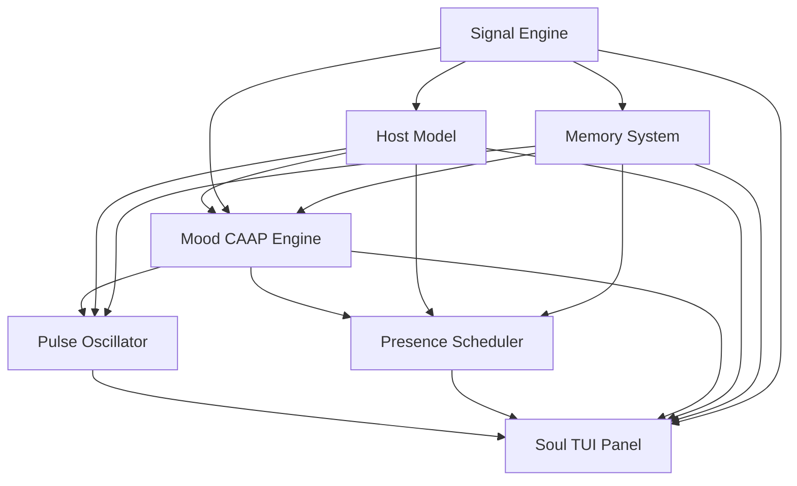

# System Architecture Overview

[← Back to doc index](../README.md)

This page describes how the **Soul Dynamics Runtime** subsystems connect and what each one is responsible for. The diagram below is the canonical high-level view of data and influence flow.

## Architecture diagram

## Subsystem roles

### Signal Engine

The Signal Engine normalizes heterogeneous inputs (PTY chunks, MCP tool metadata, file watchers, user keystroke timing, permission prompts) into typed **UniversalSignalKind** envelopes. It assigns priority, coalesces noise, and decides when semantic segmentation or an LLM **appraisal** is required before other subsystems consume the batch.

### Host Model

The Host Model tracks **task phase** (idle through closing), the active **tool stack**, sandbox posture, and permission/state flags derived from the real agent. It exposes **pressure** and **risk** scalars to mood and pulse so the soul’s physiology tracks the same dangers the user faces—without issuing tool calls itself.

### Memory System

Memory spans **working, rhythm, relationship, debt,** and **bios** layers. It scores write candidates, decays stale traces, and feeds **recall bias** (what to emphasize), **trust debt** (how costly verification felt), and **session rhythm** (cadence of success/failure) into mood, pulse, and presence schedulers.

### Mood CAAP Engine

The Mood engine implements **HADE** (hybrid appraisal–dynamics) with a **CAAP** (core / appraisal / affect / posture prototype) vector model. It blends rule-based impulses with prototype similarity over a compact set of mood basins (~64), then applies a **transition governor** so discrete states do not thrash on noisy signals.

### Pulse Oscillator

The Pulse subsystem is a **cardiac-style oscillator** with sympathetic and parasympathetic channels. It maps appraisal outputs and host pressure into BPM, HRV-like variability, and **breath coupling**, emitting pulse events the renderer turns into rail animation and terminal chrome (for example title pulse).

### Presence Scheduler

Presence chooses **behavior posture**: one of eleven modes, twelve stance refinements, and eight gaze targets. It consumes mood tendency, host task phase, and memory preferences to schedule smooth posture transitions and HUD labels that read as intentional body language, not raw logs.

### Soul TUI Panel

The Soul TUI Panel is the compositor: chafa-symbolic **avatar**, mood strip, pulse/heartbeat glyph, presence line, and optional narration. It receives **read-only** projections from every subsystem and never writes back into the host CLI stream.

## Related documentation

- [Tick cycle](./tick-cycle.md) — per-tick ordering and message flow
- [Signal subsystem](../subsystems/signal.md)
- [Host subsystem](../subsystems/host.md)
- [Memory subsystem](../subsystems/memory.md)
- [Mood subsystem](../subsystems/mood.md)
- [Pulse subsystem](../subsystems/pulse.md)
- [Presence subsystem](../subsystems/presence.md)
