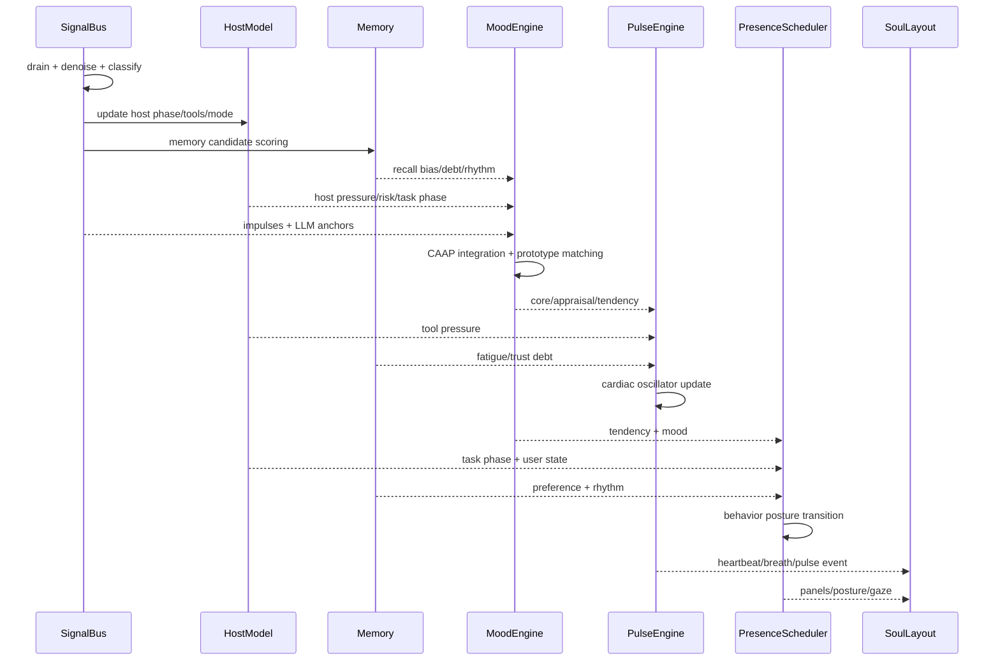

# Unified Tick Cycle

[← Back to doc index](../README.md) · [Architecture overview](./overview.md)

Every animation frame (bounded by a configurable max FPS) runs one **unified tick**. The tick is intentionally ordered so downstream subsystems never observe partially updated state: signals drain first, then host and memory publish their exports, then mood integrates, then pulse and presence, then the Soul layout redraws.

## Design goals

- **Single source of truth per tick**: Host phase and memory snapshots are versioned for the tick id; mood reads a consistent pair.
- **Cheap path by default**: Many ticks resolve from rule impulses without LLM calls; the embedding router escalates only when classification confidence is low.
- **Expressive tail**: Pulse and presence read **outputs** from mood (core/appraisal/tendency), not raw signals, so visuals stay stable under bursty I/O.

## Sequence diagram

## Phase-by-phase summary

| Phase | Owner | What happens |
|-------|--------|----------------|
| Ingest | `SignalBus` | Drain queues, redact, segment, classify; optionally request LLM appraisal for ambiguous spans |
| Host sync | `HostModel` | Update phase graph, tool stack depth, permission gates, sandbox mode from classified signals |
| Memory | `Memory` | Score promotion/eviction for each layer; emit decay-adjusted vectors for mood/pulse/presence |
| Affect | `MoodEngine` | Fuse CAAP vector with prototypes; governor enforces valid transitions and dwell time |
| Physiology | `PulseEngine` | Integrate sympathetic/para channels; emit pulse event and phase for breath |
| Posture | `PresenceScheduler` | Update mode/stance/gaze; debounce rapid oscillation when host risk spikes |
| Render | `SoulLayout` | Compose avatar + HUD; apply accessibility (reduce motion, reader mode) |

## Failure and backpressure

- If signal classification lags, the bus **coalesces** same-kind events and preserves the highest-priority pending permission or risk flag.
- If LLM appraisal is slow, mood holds the previous CAAP state but pulse may still shorten **HRV** slightly from **uncertainty** debt—a felt “waiting” without flipping mood labels.
- If the renderer drops frames, pulse integrates in wall-clock time so BPM semantics stay correct when frames skip.

## Related documentation

- [Overview](./overview.md)
- [Signal pipeline](../subsystems/signal.md)
- [Mood CAAP integration](../subsystems/mood.md)
- [Pulse events](../subsystems/pulse.md)
- [Presence state machine](../subsystems/presence.md)
