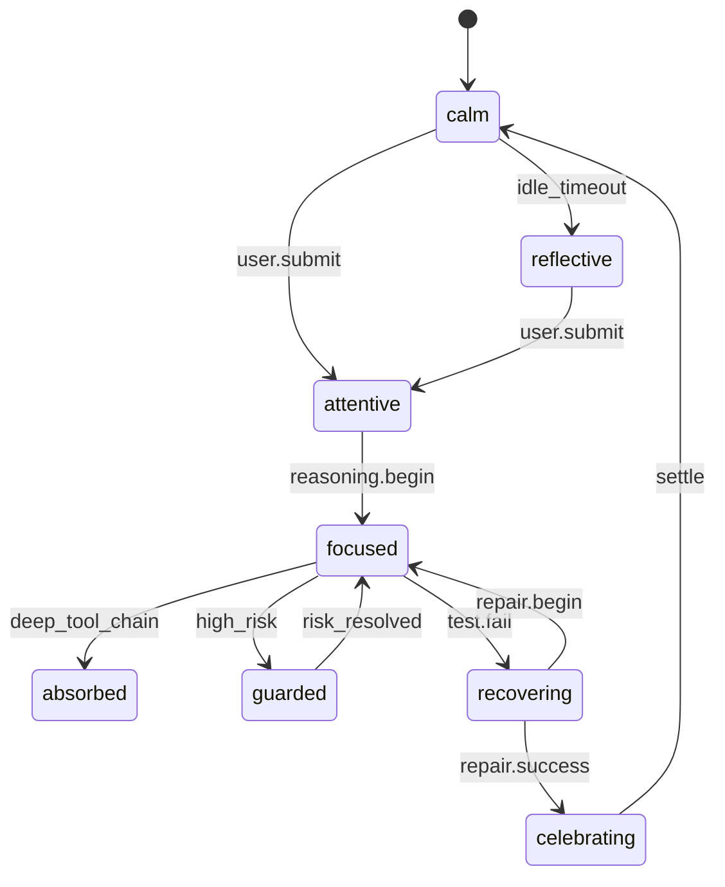

# Mood Subsystem (HADE / CAAP)

[← Back to doc index](../README.md) · [Architecture overview](../architecture/overview.md) · [Tick cycle](../architecture/tick-cycle.md)

The **HADE** mood engine implements a hybrid model: hand-tuned **rules** for safety-critical transitions, plus a continuous **appraisal** space that is discretized through **prototype matching**. The goal is readable mood labels (for HUD and traces) grounded in measurable host and memory context.

## CAAP vector model

CAAP decomposes each tick’s affective state into four coupled sub-vectors:

| Component | Symbol | Role |
|-----------|--------|------|
| **C**ore | `c⃗` | Baseline temperament and persona constraints; slow-moving; set by bios memory and soul persona |
| **A**ppraisal | `a⃗` | Event-driven evaluation of stakes, progress, and blockage; fast-updating from signals |
| **A**ffect | `f⃗` | Valence–arousal–dominance style coordinates plus tagged **tension** and **relief** channels |
| **P**osture prototype weights | `p⃗` | Soft assignment scores over the discrete mood prototype library before the governor fires |

**Integration**: \( \mathbf{m} = \mathrm{normalize}\bigl( \alpha \cdot \mathrm{embed}(\mathbf{c}) + \beta \cdot \mathrm{embed}(\mathbf{a}) + \gamma \cdot \mathrm{embed}(\mathbf{f}) + \delta \cdot \mathbf{p} \bigr) \), with \(\alpha+\beta+\gamma+\delta = 1\) (implementation may fold constants into learned defaults). Prototype kinetics are chosen so **appraisal** cannot instantly override **core** without sustained pressure.

## Mood prototypes (~64)

Prototypes are **basins** in appraisal/affect space—not arbitrary emoji labels. A typical taxonomy clusters into:

- **Stability band** (calm, reflective, patient_wait, gentle_focus)
- **Engagement band** (attentive, curious_probe, collaborative_pair, teaching stance)
- **Execution band** (focused, absorbed_flow, systematic_step, decisive_close)
- **Defense band** (guarded, skeptical_hold, permission_stalemate, risk_alert)
- **Recovery band** (recovering, repair_intent, celebrating, grateful_release)
- **Low-energy / ambiguous** (dormant_echo, drift_idle, ambiguous_signal)

Sixty-four prototypes balance **expressiveness** with **stable clustering**: each has a centroid, an allowable entrance **set**, and **momentum** (hysteresis) so similar ticks map to the same name unless a stronger basin wins for several ticks.

## Transition governor

The governor enforces:

- **Minimum dwell**: no mood flip faster than `T_min` unless a **hard interrupt** signal arrives (for example explicit user abort or catastrophic tool failure).
- **Directed edges**: some transitions are forbidden until prerequisites hold (for example `focused → absorbed` requires sustained tool chain depth without elevated risk).
- **Risk override**: elevated host risk can push into **guarded** from most execution states, bypassing dwell for safety signaling.

### Governor state diagram

## Inputs and outputs

**Inputs**

- From [Signal](./signal.md): classified impulses, optional LLM anchors
- From [Host](./host.md): pressure, risk, task phase
- From [Memory](./memory.md): recall bias, trust debt, rhythm

**Outputs**

- To [Pulse](./pulse.md): core/appraisal/tendency scalars and event tags (quickening, holding, etc.)
- To [Presence](./presence.md): discrete mood label + continuous tendency for stance interpolation
- To HUD: human-readable mood strip and trace IDs (`signalRefs`, `memoryRefs`)

## Related documentation

- [Memory inputs](./memory.md)
- [Pulse coupling](./pulse.md)
- [Presence transitions](./presence.md)
