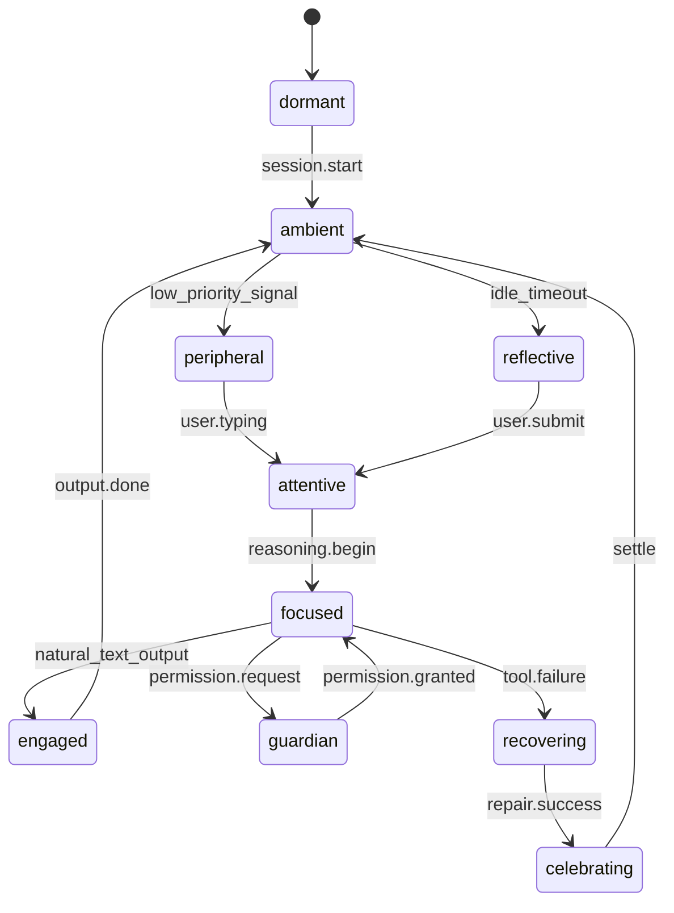

# Presence Subsystem (Behavior Posture)

[← Back to doc index](../README.md) · [Mood](./mood.md) · [Host](./host.md)

**Presence** decides how intention is *performed* in the Soul layer: how close the soul stands to the user’s attention (behavior **mode**), how weight is distributed (“stance”), and where attention points (**gaze**). It is distinct from **mood** (felt appraisal) and **pulse** (physiology), though all three cross-couple each tick.

## Cross-product space

| Axis | Cardinality | Examples |
|------|-------------|----------|
| **Modes** | 11 | `dormant`, `ambient`, `peripheral`, `attentive`, `focused`, `engaged`, `guardian`, `recovering`, `celebrating`, `reflective`, `companion` |
| **Stances** | 12 | `open`, `neutral_ready`, `lean_in`, `defer`, `protective`, `hands_busy`, `listening_wide`, `soft_minimize`, `paired_step`, `mirror_host`, `checkpoint`, `farewell` |
| **Gaze targets** | 8 | `user_input`, `host_stream`, `tool_log`, `diff_panel`, `permission_gate`, `memory_rail`, `horizon_idle`, `self_reflect` |

**Combination**: Not every `mode × stance × gaze` triplet is legal. The scheduler maintains **legality tables** so posture stays coherent (for example `guardian` mode forbids a playful stance unless risk flags clear).

## Drivers

- **Mood tendency**: continuous vector from [Mood](./mood.md) biases stance interpolation
- **Host task phase**: [Host](./host.md) phase locks some modes (tooling encourages `focused` / `engaged`)
- **Memory preference**: relationship layer nudges default distance—more formal users get `defer` / `neutral_ready` baselines

### Presence state machine

## Gaze selection heuristics

| Condition | Likely gaze |
|-----------|-------------|
| User typing in host | `user_input` |
| Long reasoning without tools | `horizon_idle` (soft) or `host_stream` |
| Tool failures spike | `tool_log` |
| Permission modal | `permission_gate` |
| Celebrating after repair | `user_input` with `open` stance |

## Outputs to UI

- **Panels**: which HUD blocks are emphasized (stance may promote narration vs metrics)
- **Posture label**: short string in the soul rail for reader mode parity
- **Gaze token**: iconographic hint in layouts that support symbols

## Related documentation

- [Tick cycle](../architecture/tick-cycle.md)
- [Settings: presence preference](../configuration/settings.md)
- [Signal categories](./signal.md)
