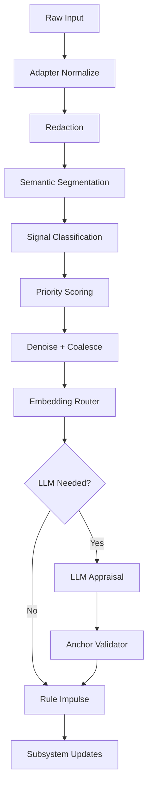

# Signal Subsystem (UniversalSignalKind)

[← Back to doc index](../README.md) · [Host](./host.md) · [Tick cycle](../architecture/tick-cycle.md)

Signals are the **typed nervous system** of the Soul Dynamics Runtime. Every observation—PTY text, MCP JSON, keystroke timing, file system hints—lands as a `UniversalSignalKind` with payload, confidence, and provenance refs.

## Pipeline overview

- **Redaction** strips secrets before embeddings or remote appraisal.
- **Denoise + coalesce** merges chatter (progress bars, spinner frames) into single higher-level events.
- **Anchor validator** rejects LLM-proposed labels that violate schema or safety invariants before they become impulses.

## UniversalSignalKind (68 types by category)

The catalog numbers **68** kinds grouped below. Names are stable enums in traces; adapters map host-specific logs into these buckets.

### Session & user (8)

`session.start`, `session.end`, `session.focus`, `session.blur`, `user.submit`, `user.cancel`, `user.typing`, `user.idle`

### Host lifecycle (6)

`host.spawn`, `host.stdout`, `host.stderr`, `host.exit`, `host.resize`, `host.title`

### Reasoning & planning (8)

`reasoning.begin`, `reasoning.chunk`, `reasoning.end`, `plan.begin`, `plan.branch`, `plan.select`, `plan.abort`, `reflect.prompt`

### Tools & execution (12)

`tool.invoke`, `tool.stdout`, `tool.stderr`, `tool.success`, `tool.failure`, `tool.timeout`, `shell.begin`, `shell.end`, `file.read`, `file.write`, `network.request`, `network.blocked`

### Permissions & safety (8)

`permission.request`, `permission.granted`, `permission.denied`, `policy.warn`, `policy.block`, `sandbox.enter`, `sandbox.violation`, `redaction.applied`

### Verification (6)

`test.queue`, `test.start`, `test.pass`, `test.fail`, `lint.issue`, `build.block`

### Editing & review (6)

`edit.begin`, `edit.chunk`, `edit.end`, `diff.ready`, `vcs.commit`, `vcs.conflict`

### Recovery & repair (4)

`repair.begin`, `repair.retry`, `repair.success`, `repair.abort`

### Model I/O (4)

`llm.token`, `llm.tool_call`, `llm.refusal`, `llm.context_trim`

### Memory & soul aux (6)

`memory.promote`, `memory.evict`, `soul.narration`, `soul.reply`, `soul.frame`, `trace.snapshot`

> **Note**: Exact enum wiring may differ by shipped version; new kinds slot into these categories to preserve analytics compatibility.

## Priority & denoise rules (summary)

| Pattern | Treatment |
|---------|-----------|
| Permission + danger tier | Non-merging; always surfaces |
| Spinner / progress noise | Coalesce to single `tool.*` heartbeat |
| Duplicate stderr lines | Collapse within time τ |
| Contradictory pass/fail | Escalate to `LLM Appraisal` if confidence low |

## Outputs

- **HostModel**: phase and stack updates
- **Memory**: candidate episodes with scored relevance
- **Mood**: impulses + validated anchors
- **UI**: optional diagnostic strip in developer mode

## Related documentation

- [Overview](../architecture/overview.md)
- [Mood inputs](./mood.md)
- [API providers for LLM appraisal](../configuration/api-providers.md)
