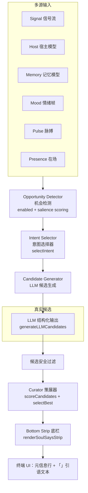
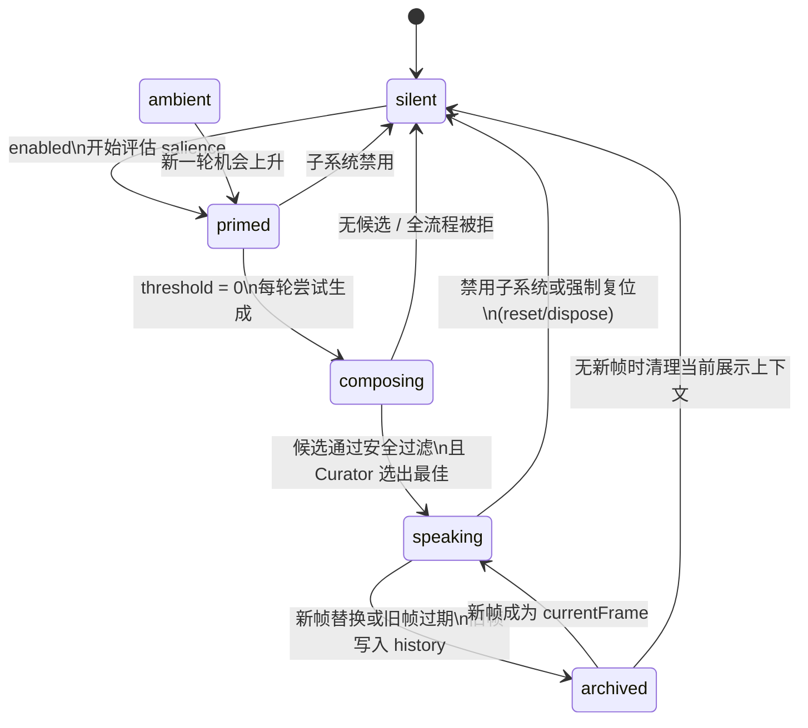

# Soul Says 灵魂发言子系统

本文档描述 **Soul Says** 子系统的设计目标、流水线架构、状态机、LLM 候选生成、策展打分、终端底栏表现，以及与 `soul-runtime` 的集成关系。

---

## 1. 概述：Soul Says 是什么

**Soul Says** 是 CLI 终端语境下运行的「内心独白 / 旁白」系统。它从 **信号（Signal）、宿主（Host）、记忆（Memory）、情绪（Mood）、脉搏（Pulse）、在场（Presence）** 等多源状态中提取语义线索，只要子系统启用且真实 LLM 可用，就会尝试生成**短段落**、**可审阅**、**可解释**的文案，并通过 **底部 Soul Says 条（Bottom Strip）** 呈现。

### 1.1 设计目的

- **情境感知**：把当前任务阶段、工具流、风险与情绪节拍转写为与当前 UI 语言一致的小段旁白，而非长篇回复。
- **即时表达**：用户是否正在输入、宿主是否正在输出、当前帧是否还在展示，都不阻止下一轮真实 LLM 候选生成。
- **真实候选**：只接收结构化 LLM 输出；无 LLM 或输出无效时保持当前可见帧或静默，不合成本地模板句。
- **安全与隐私**：依赖型话术检测、疑似密钥模式过滤、隐私/依赖风险阈值剔除等。

### 1.2 CSSS 是什么 / 不是什么

| CSSS **是** | CSSS **不是** |
|-------------|----------------|
| 终端内的 **情绪与任务节拍 UI 层**，补充「存在感」 | 第二个聊天机器人或长对话代理 |
| **可关闭** 的副输出（配置 `enabled`；无真实 LLM 时不合成发言） | 本地模板/规则短句回退 |
| **意图驱动** 的短句生成（微状态、守护、仪式、环境低声等） | 用户指令的直接执行器 |
| 与 mood / pulse / presence / host **同一tick对齐** 的观测者视角 | 替代主机会话状态机或审批逻辑 |

---

## 2. 架构总览（Mermaid 流程图）

下列流程图描述 **自底向上的数据流**：多源子系统汇总 → 机会判定 → 意图选择 → LLM 候选生成 → 策展 → 底栏展示。



> **实现注记**：当前仓库中 `engine.js` 在单次 `tick` 内只走 LLM 候选；`types.js` 中 `generation.memoryEcho`、`SAY_SOURCES` 的 `memory` / `hybrid` 等为预留扩展点，不会生成本地模板文本。

---

## 3. 状态机（Mermaid stateDiagram）

类型定义 `SAY_STATES` 包含七种机台状态；引擎 `engine.js` 当前主要切换 `silent` → `composing` → `speaking`。既有展示帧不会阻止下一轮生成；当新帧到来时，旧帧先进入 `history`，再替换为新的 `currentFrame`。帧自然过期后也会进入 `history`。



**与 `engine.js` 的对应关系（精简）**

| 状态 | 引擎行为要点 |
|------|----------------|
| `silent` | 无有效 `currentFrame`；子系统禁用、无候选、帧过期后清除 |
| `primed` | 类型中存在；**当前实现**未单独赋值，逻辑上可视为「enabled 检查后至 `composing` 前」的瞬时阶段 |
| `composing` | `transition("composing")` 后请求 LLM 候选 |
| `speaking` | 已通过策展，写入 `currentFrame` 并 `action: "speak"` |
| `cooling` | 类型中保留兼容；当前实现不再使用冷却阻止新发言 |
| `ambient` | 类型中保留兼容；当前阈值为 0，正常不会因低分转入 |
| `archived` | 帧在 `enteredAt + ttlMs + fadeMs` 后推入 `history`；机台置 `silent` |

---

## 4. 门控策略（v2：仅时间间隔）

**v2 策略**：Soul Says 已移除所有发言门控（硬门控、分数阈值、`shouldSpeak` 标志、候选最低分）。唯一的发言节制手段是 `cadence.ambientRefreshMs`（默认 3000ms）防止过于频繁的连续发言。

| 检查点 | 行为 |
|--------|------|
| `config.enabled === false` | 整个子系统禁用，不尝试任何生成 |
| `cadence.ambientRefreshMs` | 发言最小间隔，默认 **20000ms（20秒）**，范围 5000-120000ms |
| 文本长度 | 所有生成文本硬截断 **120 字符**（约 40 个中文字 / 15 个英文单词） |

**已移除的门控**（历史参考）：

| 原门控 | 原行为 | 移除原因 |
|--------|--------|----------|
| `evaluateHardGate` | 在 engine.tick 中拦截发言 | Soul Says 禁用开关已在 config.enabled 中处理 |
| `getThreshold(intent)` | 分数低于阈值时阻止发言 | 阈值已为 0，不再需要 |
| `shouldSpeak` flag (planner) | LLM planner 决定是否发言 | 发言权交给内容生成阶段 |
| `selectBest score < 0.2` | 低分候选被拒绝 | 移除最低分门限，信任策展排序 |

---

## 5. Speak Score 公式与权重

当硬门控通过后，`computeSpeakScore` 返回 `score ∈ [0,1]` 及若干分量（用于调试/扩展）。当前 `getThreshold(intent)` 恒为 `0`，因此 score 不再作为“是否发言”的限制，只用于意图/调试/未来 UI 权重参考。

### 5.1 分量

| 符号 | 含义 | 权重 |
|------|------|------|
| `signalSalience` | `max(signal.priority)/5` | **0.22** |
| `semanticNovelty` | 若有信号 `semantic.novelty > 0.5` 则为 0.7，否则 0.3 | **0.18** |
| `moodIntensity` | `max(|valence|, arousal, dominance)` | **0.16** |
| `proximityVal` | `presence.proximity`（缺省 0.3） | **0.14** |
| `memorySalience` | `working.recentSignalCount > 3` → 0.5，否则 0.2 | **0.12** |
| `timeSinceNorm` | `min(1, (now-lastSayAt)/45000)`，无历史时按 120s | **0.18** |
| `pulseEventSalience` | 见下表映射 | **0.08** |
| `userPref` | `config.mode` → expressiveness | **0.10** |
| `taskCriticality` | `waiting_approval` / `recovering` → 0.7，否则 0.3 | **0.08** |

**`pulseEvent` → `pulseEventSalience`**

| `pulse.pulseEvent` | 映射值 |
|--------------------|--------|
| `surge` | 0.9 |
| `skip` | 0.7 |
| `quickening` | 0.5 |
| `flutter` | 0.4 |
| `holding` / `exhale` | 0.3 |
| `settling` | 0.2 |
| `steady` 及其他 | 0.1 |

**`config.mode` → `userPref`（expressiveness）**

| mode | 值 |
|------|-----|
| `silent` | 0 |
| `minimal` | 0.2 |
| `balanced` | 0.5 |
| `expressive` | 0.8 |
| `debug` | 0.6 |

### 5.2 合成

\[
\begin{aligned}
\text{raw} &= 0.22\cdot s + 0.18\cdot n + 0.16\cdot m + 0.14\cdot p + 0.12\cdot mem + 0.18\cdot t \\
&\quad + 0.08\cdot pulse + 0.10\cdot pref + 0.08\cdot crit
\end{aligned}
\]

最终 `score = clamp(raw, 0, 1)`。Score 仅用于意图选择参考和调试信息，**不再作为发言门控**。所有阈值已被移除。

---

## 6. 意图类型表（16 类）

下列 16 项与 `SAY_INTENTS`（`types.js`）一致。阈值全部为 `0`；**触发** 综合自 `selectIntent` 的优先级规则（信号优先，其次情绪/在场/任务阶段/脉搏/空闲）。

| 意图 | 阈值 | 主要触发（摘要） | 示例语境 |
|------|------|------------------|----------|
| `silent` | 0 | 占位；正常不会主动选为发言意图 | — |
| `ritual_open` | 0 | `session.start` / `session.resume` | 会话开始、恢复 |
| `ritual_close` | 0 | `session.end`；`host.output.final` | 回合收尾、告别 |
| `risk_guard` | 0 | 权限/破坏性 shell、拒绝授权；`appr.risk>0.5`；`waiting_approval`；在场 `guardian` | 风险提示、守势 |
| `failure_recovery` | 0 | 测试/构建失败、shell 失败；在场 `recovering` | 失败后打气、重整 |
| `success_release` | 0 | 测试/构建通过；在场 `celebrating` | 轻释放、赞许 |
| `tool_watch` | 0 | `mcp.tool.*` 及多种文件/shell 信号；任务阶段 `tooling`/`editing`/`verifying` | 工具流旁观 |
| `plan_marker` | 0 | `host.output.plan` | 计划节点 |
| `micro_status` | 0 | 任务阶段 `reasoning`/`planning` 等；默认回退 | 极短状态 |
| `mood_reflection` | 0 | 脉搏 `surge`/`skip`；高 `arousal` | 情绪折射 |
| `memory_echo` | 0 | 在场 `reflective`；LLM 可见的记忆轨迹 | 记忆/轨迹回声 |
| `user_alignment` | 0 | `user.praise`/`user.submit` | 对齐用户积极反馈 |
| `apology_or_recalibration` | 0 | `user.critique`/`user.correct` | 道歉与重校准 |
| `ambient_whisper` | 0 | `msSinceLastActivity > 90000`（需调用方传入） | 空闲低声 |
| `subagent_comment` | 0 | `agent.subagent.*` | 子代理旁白 |
| `web_research_note` | 0 | `web.search.*` / `web.failure` | 检索笔记 |

> **集成注记**：`ambient_whisper` 依赖 `input.msSinceLastActivity`；若宿主 `tick` 未传入该字段，空闲分支可能不会生效，可在 `soul-runtime` 将来扩展中补齐。

---

## 7. 候选生成

### 7.1 LLM 候选

Soul Says 当前只接受真实 LLM 候选，不再携带本地模板库或规则化文本回退。`generateLLMCandidates()` 会把当前 `mood`、`pulse`、`presence`、`host`、`signals`、`memory` 和 `intent` 汇入提示词，让模型生成 1-3 个有事实依据的候选段落。

如果 LLM 不可用或输出无效，本轮保持当前可见帧或静默；系统不会合成本地模板句。

### 7.2 记忆回声（设计要点）

**目标**：在 **相似情境** 下复用 **低风险**、**不重复啰嗦** 的记忆片段，作为 LLM 候选的事实依据。

| 维度 | 说明 |
|------|------|
| **相似性** | 与当前 `signals` / `host.session.taskPhase` / `memory.working` 轨迹对齐；可与未来向量或规则 index 结合 |
| **隐私** | 候选 `privacyRisk` 超过 `config.safety.privacyRiskThreshold` 时，在 Curator 中直接剔除 |
| **复现与疲劳** | 当前不做速率阻塞；重复内容由 Curator 的近期文本哈希惩罚处理 |

**现状**：独立「记忆检索 → 候选」分支尚未在 `engine.js` 中实现；`memory_echo` 意图主要通过 LLM 提示中的轨迹字段体现；`createSayCandidate` 已支持 `memoryBasis` 供策展加权。

### 7.3 Layer 3：LLM 结构化输出

**触发预算**

- `createSoulSaysEngine({ llm })` 注入；`canUseLLM` 只检查真实 LLM 是否存在且 `generation.llmCandidates !== false`。
- `maxLlmCallsPerHour`、冷却字段和 `llmOnlyAtCheckpoints` 不再作为阻塞条件；保留在配置结构中只是为了兼容旧配置。
- `shouldUseLLM(intent, signals)` 当前恒为真，用户输入、宿主输出和当前帧都不会阻止 LLM 候选生成。

**提示构建** — `buildSoulSaysPrompt` 注入：`mood` VAD、`pulse`、`presence`、`host.taskPhase`、`signals` 尾部、`memory.working.recentMoodPath`（轨迹串）、所请求 `intent`、以及 `personality` 中的 warmth/playfulness。

**JSON Schema** — `SOUL_SAYS_SCHEMA`（`llm-generator.js`）要点：

- 根对象 `candidates`: 数组，**最多 3** 条。
- 每项字段：`text`（`maxLength: 120`）、`intent`、`tone`（枚举与 `SAY_TONES` 一致）、`intensity`、`factualBasis[]`、`shouldDisplay`、`risk: { privacy, dependency, hallucination, interruption }`。
- `required`: `text`, `intent`, `tone`, `shouldDisplay`（顶层还要求 `candidates`）。

**后处理**：`shouldDisplay === false` 的条目丢弃；映射为 `source: "llm"` 的 `SayCandidate`，并继承风险分数到 Curator。

---

## 8. Curator 策展打分公式 `scoreCandidates`

对 **已通过** 安全预筛（依赖话术、密钥模式）的候选，计算：

\[
\begin{aligned}
\text{brevityW} &= \begin{cases}
0.8 & \text{micro} \\
0.6 & \text{short} \\
0.4 & \text{normal}
\end{cases} \\
\text{memBoost} &= \text{candidate.memoryBasis.length} > 0 \ ?\ 0.7 : 0.3 \\
\text{moodFit} &= \text{moodFitScore}(\text{tone}, \text{moodId}, \text{core}) \in [0.5, 0.9]
\end{aligned}
\]

\[
\begin{aligned}
\text{raw} &= 0.22\cdot rel + 0.18\cdot fact + 0.14\cdot nov + 0.12\cdot style + 0.10\cdot brevityW \\
&\quad + 0.10\cdot pri + 0.08\cdot memBoost + 0.06\cdot moodFit \\
&\quad - 0.18\cdot inter - 0.18\cdot priv - 0.14\cdot dep - 0.10\cdot repPen
\end{aligned}
\]

- `rel` / `fact` / `nov` / `style` / `pri`：候选自带字段 `relevance`、`factuality`、`novelty`、`styleFit`、`priority`。
- **安全前置剔除**：`privacyRisk > privacyRiskThreshold` 或 `dependencyRisk > dependencyRiskThreshold` 时 **整候选丢弃**（不参与排序）。
- **重复惩罚** `repPen`：全文哈希命中近期集合则为 `0.6`，否则 `0`。
- `selectBest`：取最高分候选；选中后加入近期哈希环（容量约 40）。**无最低分门限**。

---

## 9. 展示生命周期：enter → hold → fade → archive

与 `createSayDisplayFrame`、`engine.js` 中帧驱逐逻辑一致。

| 阶段 | 行为 |
|------|------|
| **enter** | 若已有 `currentFrame`，先写入 `history`；新帧 `enteredAt = now`，设置 `ttlMs`（意图默认见 `INTENT_TTL`）、`fadeMs`（默认 **800ms**）、`visibility` / `meta` / `trace` |
| **hold** | `now < enteredAt + ttlMs` 期间，底栏持续展示当前 `frame` |
| **fade** | 语义上紧随 TTL；引擎在 `ttlMs + fadeMs` 前仍保留 `currentFrame`，TUI 可据此刻度做弱化（若未来接入） |
| **archive** | 超时后：若 `text` 非空则 `history.push(frame)`，裁剪至 `bottomStrip.historySize`；`currentFrame = null`，机台 `silent` |

---

## 10. 各状态视觉规范（底栏）

### 10.1 `visibility` 与 24bit 颜色（`tui.js`）

| `visibility` | 前景 `fg` | 边框 / 强调 |
|----------------|-----------|-------------|
| `hidden` | `null`（主题回退） | `#2F3A4F` |
| `dim` | `#607080` | `#2F3A4F` |
| `normal` | `#B0BEC5` | `#4A6080` |
| `bright` | `#E0F0FF` | `#70A0D0` |
| `guard` | `#FF9966` | `#CC6633` |

**引擎默认映射**（`createSayDisplayFrame` 前）：

- `risk_guard` → `guard`
- `ambient_whisper` → `dim`
- `success_release` → `bright`
- 其他 → `normal`

### 10.2 意图图标（前缀符号）

`SAYS_INTENT_ICONS`：`micro_status`/`ambient_whisper` → `◌`；`mood_reflection` → `◎`；`risk_guard` → `⚠`；`plan_marker` → `▸`；`tool_watch` → `⟐`；`failure_recovery` → `↺`；`success_release` → `✓`；`memory_echo` → `❋`；`user_alignment` → `↵`；`ritual_open` → `☀`；`ritual_close` → `☾`；`subagent_comment` → `⤴`；`web_research_note` → `⊛`；`apology_or_recalibration` → `↻`；`silent` → 空格。

### 10.3 静默条（无 `frame` 时）

`renderSaysQuietStrip` 根据 `soulSays.state` 显示极简状态行，如 `◌ soul silent`；图标映射含 `silent`/`primed`/`composing`/`ambient`/`cooling` 等。

---

## 11. 配置参考（完整默认 JSON）

以下为 `DEFAULT_SAYS_CONFIG`（`types.js`）的默认结构，运行时可由 `createSoulSaysEngine({ config: … })` 或上层 `config.soulSays` 合并覆盖。

```json
{
  "enabled": true,
  "mode": "balanced",
  "bottomStrip": {
    "visible": true,
    "height": 2,
    "showMeta": true,
    "showCauseInDebug": false,
    "historySize": 5
  },
  "generation": {
    "memoryEcho": true,
    "llmCandidates": true,
    "llmOnlyAtCheckpoints": false,
    "maxLlmCallsPerHour": 0
  },
  "personality": {
    "warmth": 1,
    "playfulness": 1,
    "anthropomorphism": 1,
    "technicality": 2,
    "metaphor": 1,
    "emoji": 0
  },
  "cadence": {
    "minCooldownMs": 0,
    "maxPerMinute": 0,
    "maxAmbientPerHour": 0,
    "maxMemoryEchoPerHour": 0,
    "afterMicroStatusMs": 0,
    "afterMemoryEchoMs": 0,
    "afterPlayfulMs": 0,
    "afterRiskGuardMs": 0,
    "ambientRefreshMs": 3000
  },
  "safety": {
    "noDependencyLanguage": true,
    "requireFactualBasis": true,
    "redactSecrets": true,
    "privacyRiskThreshold": 0.25,
    "dependencyRiskThreshold": 0.2
  },
  "idle": {
    "firstWhisperAfterMs": 90000,
    "repeatWhisperMinMs": 300000,
    "onlyWhenLowRisk": true
  }
}
```

`maxLlmCallsPerHour: 0` 在当前实现中表示不做小时级限制；Soul Says 仍要求真实 LLM 可用，不会用本地模板伪造内容。

---

## 12. 与 `soul-runtime.js` tick 周期的集成

`soul-runtime.js` 中 `createSoulRuntime` 在每次 `tick(now)` 内顺序执行：

1. `moodEngine.maybeRunLLMAnchor()`  
2. `moodEngine.tick` → `moodFrame`  
3. `hostModel.update(recentSignalsV2)`  
4. `memoryModel.update(…)` → `memState`  
5. `pulseEngine.tick(…)` → `pulseState`  
6. `presenceScheduler.update(…)` → `presenceState`  
7. **`saysEngine.tick({ signals: recentSignalsV2, host, mood, pulse, presence, memory, now })`**  
8. 清理 30s 前旧信号，组装返回的 `SoulFrame`

`soulSays` 挂在返回帧上：

- `action`：`speak` | `update_meta` | `silent`
- `frame`：当前 `SayDisplayFrame`（若有）
- `history`：`getHistory()`
- `state`：`machineState`

**设计要点**：Soul Says **不**反过来驱动 mood/pulse，只 **消费** 已对齐的子状态；异常被吞掉以免破坏整轮 tick。

---

## 13. 源码文件索引

| 文件 | 职责 |
|------|------|
| `src/soul-says/types.js` | 意图/音色/可见性/状态枚举；`DEFAULT_SAYS_CONFIG`；`INTENT_THRESHOLDS` / `INTENT_TTL`；`createSayCandidate`、`createSayDisplayFrame`、`createSayDecision` |
| `src/soul-says/opportunity.js` | `evaluateHardGate`、`computeSpeakScore`、`getThreshold` |
| `src/soul-says/intent.js` | `selectIntent`、`intentToTone`、`intentToBrevity` |
| `src/soul-says/curator.js` | `scoreCandidates`、`selectBest`；`containsDependencyLanguage`、`containsSecrets` |
| `src/soul-says/llm-generator.js` | `SOUL_SAYS_SCHEMA`、`buildSoulSaysPrompt`、`generateLLMCandidates` |
| `src/soul-says/engine.js` | `createSoulSaysEngine`：状态、真实 LLM 生成、`tick` 流水线、帧生命周期 |
| `src/soul-says/index.js` | 对外 re-export |
| `src/mood/soul-runtime.js` | 创建引擎并注入 `config.soulSays` 与 `llm`；tick 中调用 |
| `src/life/tui.js` | `renderSoulSaysStrip`、`SAYS_VISIBILITY_STYLES`、`SAYS_INTENT_ICONS` |

---

## 14. 版本与维护

- 本文档与仓库源码 **同路径演进**；若增删意图、权重或门控条件，请同步更新本节与相关表。
- 不再维护本地模板库；新增表达能力应进入 LLM 提示、schema 或策展规则，而不是添加固定句库。
