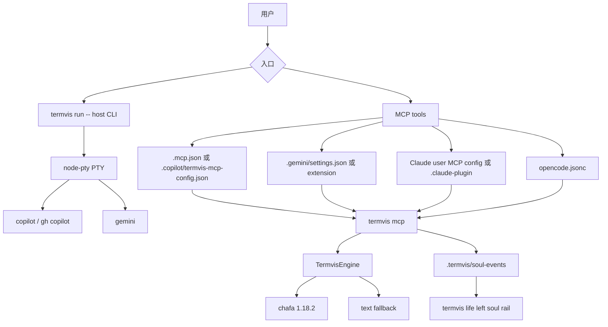
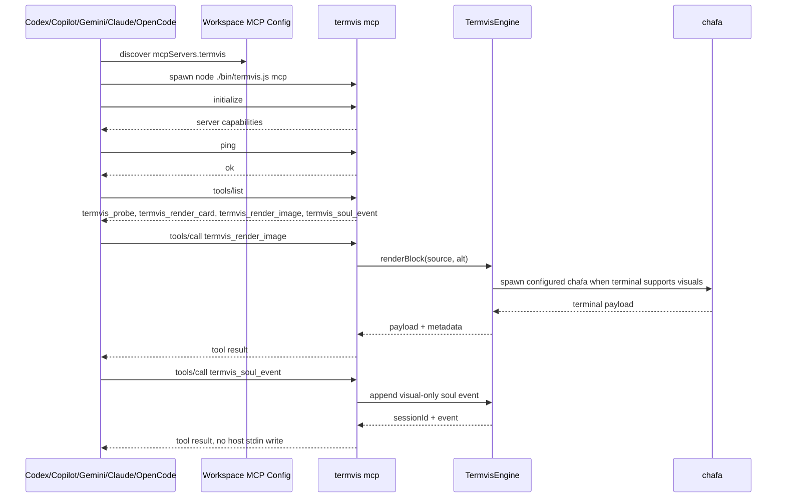

# AI CLI 使用指南

本文档说明当前仓库中 `termvis` 如何接入 Codex CLI、GitHub Copilot CLI、Google Gemini CLI、Claude Code 与 OpenCode。目标是让两类入口都可实际使用：

- 可视终端入口：`termvis life -- <host-cli>`，通过左侧 soul rail + 右侧 host viewport 包装宿主 CLI。
- Agent 工具入口：`termvis mcp`，通过 MCP 暴露 `termvis_probe`、`termvis_render_card`、`termvis_render_image`、`termvis_life_frame`、`termvis_soul_event`。

## 权威参考

| 主题 | 官方来源 | 当前实现采用点 |
|---|---|---|
| GitHub Copilot CLI 概念 | https://docs.github.com/en/copilot/concepts/agents/copilot-cli/about-copilot-cli | Copilot CLI 支持交互式和 programmatic 两类使用方式 |
| Copilot CLI 命令参考与 MCP 配置 | https://docs.github.com/en/copilot/reference/copilot-cli-reference/cli-command-reference | 本地 MCP server 使用 `command`、`args`、`tools`、`cwd`、`env`、`timeout`；单次会话可用 `--additional-mcp-config` |
| `gh copilot` 手册 | https://cli.github.com/manual/gh_copilot | `gh copilot -- ...` 可把参数透传给 Copilot CLI |
| GitHub Copilot CLI 开源仓库 | https://github.com/github/copilot-cli | 本地 CLI 名称、交互入口和 agent 模式跟随上游 |
| Gemini CLI MCP 文档 | https://google-gemini.github.io/gemini-cli/docs/tools/mcp-server.html | Gemini 使用 `settings.json` 的 `mcpServers` 发现 stdio/http/sse MCP server |
| Gemini CLI 配置文档 | https://google-gemini.github.io/gemini-cli/docs/get-started/configuration.html | 项目级 `.gemini/settings.json` 可声明 MCP server、tool include/exclude、timeout 与 trust |
| Gemini CLI 开源仓库 | https://github.com/google-gemini/gemini-cli | 本地 CLI、扩展目录与 MCP 管理命令跟随上游 |
| Claude Code 安装文档 | https://docs.anthropic.com/en/docs/claude-code/getting-started | 用户级安装使用 `npm install -g @anthropic-ai/claude-code`，命令为 `claude` |
| OpenCode 文档 | https://opencode.ai/docs/ | 终端 CLI 可通过 `npm install -g opencode-ai` 安装，命令为 `opencode` |
| OpenCode CLI/MCP 文档 | https://opencode.ai/docs/cli/ | `opencode mcp list` 可检查本地 MCP server 连接状态 |

## 本机状态

当前仓库已经落下这些真实配置文件：

| 文件 | 用途 |
|---|---|
| `.mcp.json` | Copilot CLI 可发现的工作区 MCP 配置 |
| `.copilot/termvis-mcp-config.json` | Copilot CLI 单次会话附加 MCP 配置 |
| `.gemini/settings.json` | Gemini CLI 项目级 MCP 配置 |
| `.gemini/extensions/termvis/gemini-extension.json` | Gemini extension 形式的 termvis MCP 配置 |
| `.gemini/extensions/termvis/GEMINI.md` | Gemini extension 附带上下文说明 |
| `.claude-plugin/*` | Claude Code plugin 形式的 termvis MCP 说明与配置 |
| `opencode.jsonc` | OpenCode 项目级 MCP 配置 |
| `termvis.config.jsonc` | 固定项目内 chafa 1.18.2 的非回退渲染路径 |

本机已验证的 CLI：

```bash
codex --version
copilot --version
gemini --version
claude --version
opencode --version
```

当前本机结果：

```text
codex-cli 0.125.0
GitHub Copilot CLI 1.0.38
gemini 0.40.0
Claude Code 2.1.123
opencode 1.14.30
```

## 链路总览



## Codex CLI

本机已用真实命令写入 Codex 全局 MCP 配置：

```bash
codex mcp add termvis --env TERMVIS_HOST=codex -- \
  termvis mcp
```

验证：

```bash
codex mcp list
```

期望看到 `termvis`，命令为 `termvis mcp`，状态为 `enabled`。

## Copilot CLI

### 1. 预检查

```bash
copilot --version
gh copilot -- --help
node ./bin/termvis.js adapter copilot --json
```

如果 Copilot 还没有登录，先运行：

```bash
copilot login
```

也可以通过 GitHub CLI 入口运行 Copilot。需要把 Copilot 自己的参数放在 `--` 后面：

```bash
gh copilot -- --help
```

### 2. 验证 MCP 配置

仓库已经包含 `.mcp.json`，Copilot CLI 在当前工作区可读取此配置。也可以显式附加配置文件：

```bash
copilot mcp list --json --additional-mcp-config @.copilot/termvis-mcp-config.json
```

期望能看到 `termvis` server，以及这些工具：

```text
termvis_probe
termvis_render_card
termvis_render_image
termvis_life_frame
termvis_soul_event
```

### 3. 交互式使用

从仓库根目录启动：

```bash
copilot --additional-mcp-config @.copilot/termvis-mcp-config.json
```

进入 Copilot 后可以直接要求它使用 MCP 工具，例如：

```text
Use the termvis_probe MCP tool and summarize the terminal capability report.
```

渲染测试图像：

```text
Use termvis_render_image to render test/fixtures/termvis-sample.svg with alt text "termvis sample".
Use termvis_life_frame with state "reasoning", host "copilot", and message "planning the next command".
Use termvis_soul_event with mood "curious shimmer", presence "near the prompt", and reply "I will keep the terminal steady while the command is checked."
```

### 4. Programmatic 使用

```bash
copilot -p "Use termvis_probe and summarize this terminal's visual capability." \
  --additional-mcp-config @.copilot/termvis-mcp-config.json
```

如果使用 `gh` 入口：

```bash
gh copilot -- -p "Use termvis_probe and summarize this terminal's visual capability." \
  --additional-mcp-config @.copilot/termvis-mcp-config.json
```

### 5. 可视终端包装

当你希望 Copilot CLI 保持真实 TTY 行为，并让 `termvis` 在同一终端中负责视觉能力探测与渲染时：

```bash
node ./bin/termvis.js run -- copilot
```

也可以通过 GitHub CLI：

```bash
node ./bin/termvis.js run -- gh copilot
```

需要完整数字灵魂常驻 TUI 时使用 `life`，不要只用 `run`：

```bash
node ./bin/termvis.js life --title "Copilot Soul" --soul-name "Termvis Soul" -- copilot
```

## Gemini CLI

### 1. 预检查

```bash
gemini --version
node ./bin/termvis.js adapter gemini --json
```

如果当前 Gemini CLI 使用 Gemini API，本机必须设置 API key：

```bash
export GEMINI_API_KEY="your-key"
```

没有 `GEMINI_API_KEY` 时，Gemini CLI 可以显示版本、帮助与 `gemini mcp list` 连接状态；实际模型会话会失败。

### 2. 验证 MCP 配置

仓库已经包含 `.gemini/settings.json`：

```json
{
  "mcpServers": {
    "termvis": {
      "command": "termvis",
      "args": ["mcp"],
      "timeout": 30000,
      "trust": false,
      "includeTools": [
        "termvis_probe",
        "termvis_render_card",
        "termvis_render_image",
        "termvis_life_frame",
        "termvis_soul_event"
      ],
      "env": {
        "TERMVIS_HOST": "gemini"
      }
    }
  }
}
```

验证：

```bash
gemini mcp list
```

当前 Gemini CLI 0.40.0 的 stdio MCP 使用 newline-delimited JSON。`termvis mcp` 已同时兼容 newline JSON 和 `Content-Length` framing，因此 `gemini mcp list --debug` 应显示：

```text
termvis ... Connected
```

如果你想用 Gemini CLI 自己的管理命令重新写入项目级配置：

```bash
gemini mcp add --scope project --type stdio --timeout 30000 \
  --include-tools termvis_probe,termvis_render_card,termvis_render_image,termvis_life_frame,termvis_soul_event \
  -e TERMVIS_HOST=gemini \
  termvis mcp
```

### 3. 交互式使用

从仓库根目录启动：

```bash
gemini
```

进入 Gemini 后先检查 MCP 状态：

```text
/mcp
```

然后使用：

```text
Use termvis_probe and summarize the terminal visual capabilities.
```

渲染测试图像：

```text
Use termvis_render_image to render test/fixtures/termvis-sample.svg with alt text "termvis sample".
Use termvis_life_frame with state "reasoning", host "gemini", and message "planning the next command".
Use termvis_soul_event with mood "curious shimmer", presence "near the prompt", and reply "I am watching the plan take shape without touching the real CLI."
```

### 4. Programmatic 使用

```bash
gemini -p "Use termvis_probe and summarize this terminal's visual capability."
```

### 5. 可视终端包装

```bash
node ./bin/termvis.js run -- gemini
```

完整 soul rail：

```bash
node ./bin/termvis.js life --title "Gemini Soul" --soul-name "Termvis Soul" -- gemini
```

## Claude Code

本机已安装 `claude`，并用 Claude Code 的用户级 MCP 配置注册 `termvis`：

```bash
claude mcp add-json -s user termvis \
  '{"type":"stdio","command":"termvis","args":["mcp"],"env":{"TERMVIS_HOST":"claude-code"}}'
```

验证：

```bash
claude mcp list
```

期望输出：

```text
termvis ... Connected
```

完整 soul rail：

```bash
node ./bin/termvis.js life --title "Claude Soul" --soul-name "Termvis Soul" -- claude
```

## OpenCode

本机已安装 `opencode`，项目根目录包含 `opencode.jsonc`：

```json
{
  "mcp": {
    "termvis": {
      "type": "local",
      "command": [
        "termvis",
        "mcp"
      ],
      "enabled": true
    }
  }
}
```

验证：

```bash
opencode mcp list
```

期望输出 `termvis connected`。

完整 soul rail：

```bash
node ./bin/termvis.js life --title "OpenCode Soul" --soul-name "Termvis Soul" -- opencode
```

## MCP 时序



## 非回退渲染验证

MCP 配置可用不等于当前 shell 一定能做非回退图像渲染。非回退需要真实 TTY、颜色能力、`node-pty`、项目内 `chafa` 与当前配置同时满足。

在真实终端中运行：

```bash
env -u NO_COLOR TERM=xterm-256color COLORTERM=truecolor \
  node ./bin/termvis.js doctor --strict
```

期望输出包含：

```text
nonfallback:ready
```

渲染真实样例：

```bash
node ./bin/termvis.js render test/fixtures/termvis-sample.svg --alt "termvis sample"
```

在非 TTY、`TERM=dumb`、`NO_COLOR` 生效或 CI 管道中，`termvis` 会进入文本回退。这个回退是设计内行为，不代表 Copilot/Gemini MCP 配置不可用。

## 故障定位

| 现象 | 检查 |
|---|---|
| Copilot 看不到 `termvis` | 运行 `copilot mcp list --json --additional-mcp-config @.copilot/termvis-mcp-config.json` |
| Copilot 参数被 `gh` 截走 | 使用 `gh copilot -- <copilot args>` |
| Gemini 报缺少 API key | 设置 `GEMINI_API_KEY` 后重新启动 `gemini` |
| Gemini 看不到 MCP server | 确认从仓库根目录运行，并检查 `.gemini/settings.json`；`gemini mcp list --debug` 应显示 Connected |
| Claude 看不到 MCP server | 运行 `claude mcp list`；必要时重新执行上面的 `claude mcp add-json -s user ...` |
| OpenCode 看不到 MCP server | 确认从仓库根目录运行，并检查 `opencode.jsonc`；运行 `opencode mcp list` |
| MCP server 启动失败 | 运行 `printf 'Content-Length: 58\r\n\r\n{"jsonrpc":"2.0","id":1,"method":"initialize","params":{}}' \| termvis mcp`，应返回 Content-Length 响应；再检查 MCP 配置里的 `command`/`args` |
| soul 旁白不变化 | 确认 `termvis life` 正在运行，且 MCP 调用了 `termvis_soul_event`；查看 `.termvis/soul-events/latest` 指向的 JSONL 文件 |
| 图像渲染变成纯文本 | 在真实 TTY 中运行 `doctor --strict` 查看 `fallbackReasons` |
