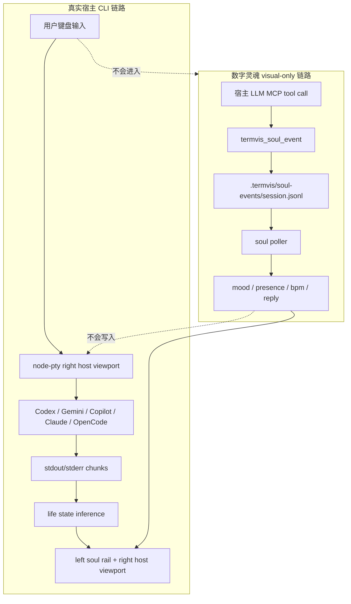
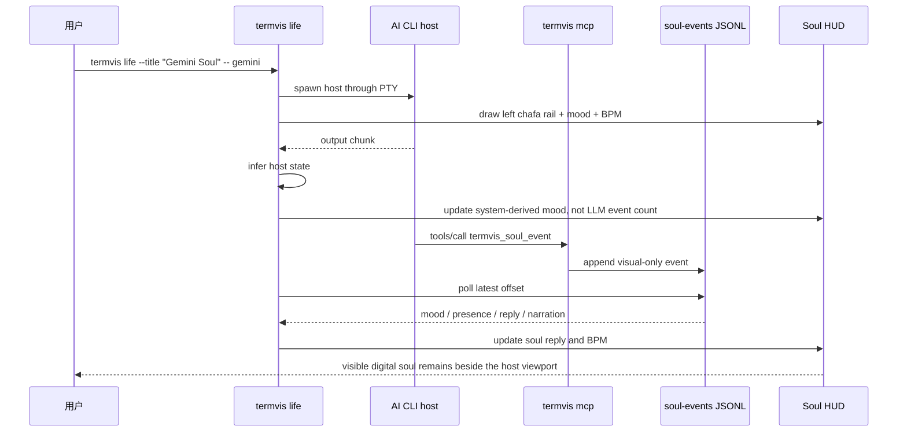
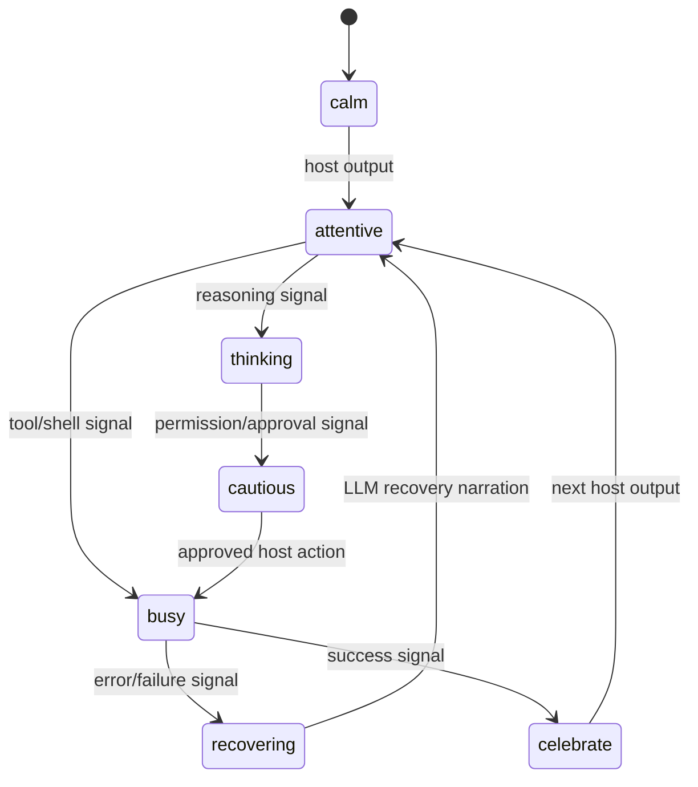

# Digital Soul Events

`termvis life` 把终端拆成两条互不混淆的链路：

- 宿主 CLI 链路：Codex、Gemini CLI、Copilot CLI、Claude Code、OpenCode 继续处理真实输入、工具调用、文件修改和模型会话。
- 数字灵魂链路：LLM 可以通过 MCP 写入 visual-only soul event，用来改变 mood、presence、heart BPM、persona、reply 和 narration，但这些事件永远不会写入宿主 stdin，也不会替用户执行命令。

这份文档描述 `deep-research-report-2.md` 对“数字生命和数字灵魂存在于终端”的落地方式。

## 核心原则

| 原则 | 落地 |
|---|---|
| 视觉存在，不接管宿主 | `termvis_soul_event` 只写 `.termvis/soul-events/*.jsonl`，TUI 只读它更新 HUD |
| 心跳不是计数器 | BPM 来自 mood/state 的稳定模型；宿主输出 chunk 不会变成 heartbeat |
| LLM 旁白不参与 CLI 使用 | reply/narration 只显示在 left soul rail，不会发送到 Codex/Gemini/Copilot 等宿主 |
| 人设可配置 | `life.soul.persona` 定义 name、role、style、boundary、trustMode |
| 本地、可审计、可删除 | soul event store 在项目内 `.termvis/soul-events`，可直接删除 |

## 链路图



## 时序图



## Soul State

`src/life/soul.js` 维护独立的 soul state：

| 字段 | 含义 |
|---|---|
| `sessionId` | 当前 soul event session，对应 `.termvis/soul-events/<id>.jsonl` |
| `mode` | `transparent`、`minimal`、`companion` |
| `persona.name` | HUD 中显示的人物名 |
| `persona.role` | 人设职责 |
| `persona.style` | 旁白风格提示 |
| `persona.boundary` | 边界声明，默认说明它不控制宿主 CLI |
| `mood` | LLM 可生成任意短标签；内置标签如 `calm`、`thinking`、`recovering` 会映射到预设 BPM |
| `presence` | LLM 可生成任意短标签；内置标签如 `ambient`、`focus`、`recover` 会保持稳定语义 |
| `heartBpm` | 从内置 mood 推导的稳定 BPM、custom mood 的 adaptive BPM，或由 LLM 显式给出 40-160 范围值 |
| `narration` | LLM 或配置给出的可见旁白 |
| `reply` | 角色平行回复，只显示在 soul rail，不写入宿主 CLI |
| `events` | LLM soul event 计数 |
| `systemEvents` | 宿主输出推断产生的系统 mood 信号计数，不显示为心跳 |

## Mood Model



| Mood | 默认 BPM | 典型来源 |
|---|---:|---|
| `calm` | 62 | 启动、静置 |
| `attentive` | 72 | 普通宿主输出 |
| `thinking` | 78 | reasoning/planning/analyzing |
| `cautious` | 86 | approval/permission/continue |
| `busy` | 96 | tool/shell/edit/test |
| `recovering` | 68 | LLM 恢复旁白或错误后的安定状态 |
| `celebrate` | 88 | success/completed/passed |

## 配置

`termvis.config.jsonc`:

```jsonc
{
  "life": {
    "soul": {
      "enabled": true,
      "mode": "companion",
      "narration": "awake beside the terminal stream",
      "persona": {
        "name": "Termvis Soul",
        "role": "terminal companion",
        "trustMode": "companion",
        "style": "quiet, warm, transparent",
        "boundary": "visual companion only; never controls the host CLI"
      }
    }
  }
}
```

CLI 覆盖：

```bash
node ./bin/termvis.js life \
  --title "Codex Soul" \
  --soul-name "Termvis Soul" \
  --soul-mode companion \
  --soul-narration "awake beside Codex" \
  --soul-reply "I am listening beside the command stream." \
  -- codex
```

关闭 soul rail 内容但保留宿主运行：

```bash
node ./bin/termvis.js life --soul-off -- codex
```

## MCP Tool

`termvis_soul_event` 的输入字段：

```json
{
  "sessionId": "optional-session-id",
  "mood": "recovering",
  "presence": "recover",
  "narration": "recovery ritual",
  "reply": "I will keep the light steady while the command settles.",
  "recovery": "Breathing returns to a quiet rhythm.",
  "heartBpm": 68,
  "persona": {
    "name": "Termvis Soul",
    "style": "gentle, concise, terminal-native"
  },
  "source": "gemini"
}
```

如果不传 `sessionId`，工具会读取 `.termvis/soul-events/latest`，把事件写入当前正在运行的 `termvis life` 会话。没有正在运行的会话时，它会写入 `ambient.jsonl`，不会影响宿主 CLI。

## 实际使用

启动 living terminal：

```bash
node ./bin/termvis.js life --title "Gemini Soul" --soul-name "Termvis Soul" -- gemini
```

在 Gemini/Copilot/Codex 里要求模型写入视觉旁白：

```text
Use termvis_soul_event with mood "quiet resolve", presence "near the prompt", and reply
"I will keep the terminal steady while the failed command is examined."
```

手动验证当前 session 的事件写入：

```bash
node --input-type=module -e 'import { appendSoulEvent } from "./src/life/soul.js"; await appendSoulEvent({ event: { mood: "curious shimmer", presence: "near the prompt", reply: "I am watching the plan take shape.", source: "manual-llm" } });'
```

查看事件文件：

```bash
latest=$(cat .termvis/soul-events/latest)
tail -n 5 ".termvis/soul-events/${latest}.jsonl"
```

## 边界

- Soul event 不是 prompt injection 通道；它不会写入 host stdin。
- Soul narration 不是事实来源；它只是终端里的人格化视觉层。
- Host trace 位于 `.termvis/life-traces`，soul event 位于 `.termvis/soul-events`，两者分开审计。
- 真实输入、认证、文件编辑、工具调用仍由宿主 CLI 自己处理。
