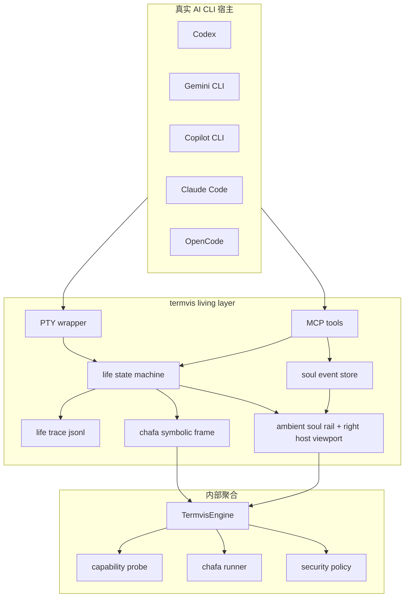
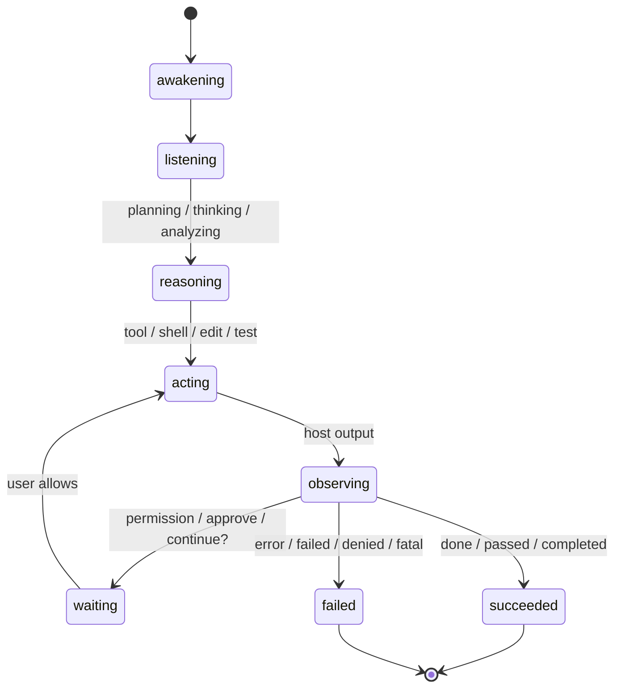
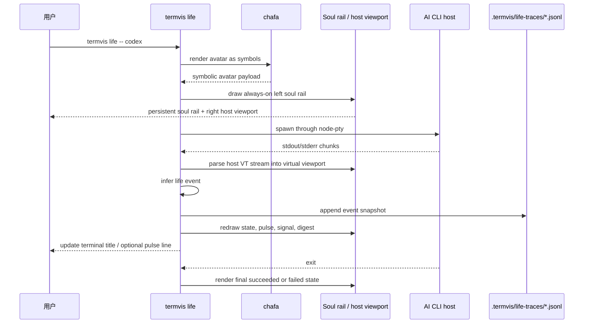
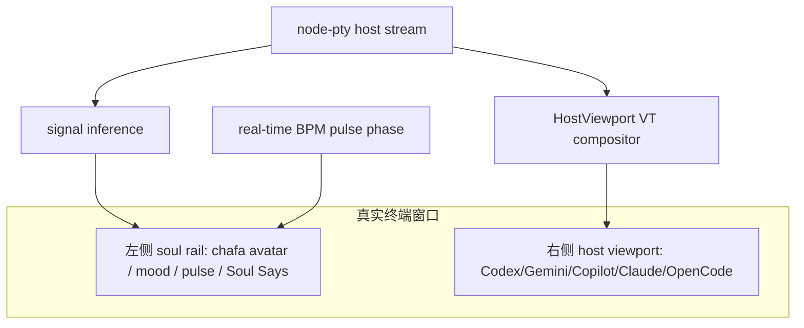
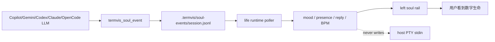
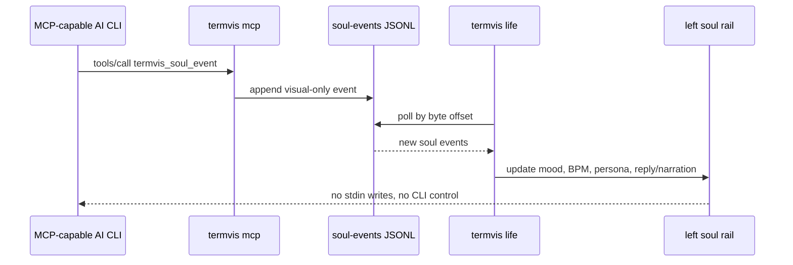

# Living Terminal Architecture

`chafa_cli` 的主题不是“在 CLI 里显示图片”，而是用 chafa 把终端中的 AI CLI 重新组织成一个有状态、有姿态、有可见生命迹象的数字生命界面。Codex、Gemini CLI、GitHub Copilot CLI、Claude Code、OpenCode 仍然是各自真实的宿主；`termvis` 负责在 PTY、MCP、状态机、符号化 avatar、visual-only soul event 和审计 trace 之间建立生命层。

## 权威资料整合

| 领域 | 权威来源 | 对当前实现的约束 |
|---|---|---|
| chafa 渲染能力 | https://hpjansson.org/chafa/ | chafa 适合作为终端图形/Unicode mosaic/符号化 avatar 渲染器，支持 Kitty、iTerm2、Sixel、Unicode mosaics、Truecolor、256 色、CJK/fullwidth |
| chafa CLI 参数 | https://hpjansson.org/chafa/man/ | living avatar 默认使用 `--format symbols`、`--colors full`、`--view-size`、`--font-ratio`、`--symbols`；像素协议只在显式 `--pixel` 时启用 |
| PTY 边界 | https://github.com/microsoft/node-pty | 宿主 AI CLI 通过 PTY 启动；node-pty 不跨 worker 线程共享；面向外网服务时必须考虑权限隔离 |
| xterm.js/headless | https://github.com/xtermjs/xterm.js/ | 当前实现先内置轻量 `HostViewport` compositor 来保护左右布局；后续 Web 观测和完整 VT 回放可继续接入 headless terminal state |
| xterm.js addons | https://xtermjs.org/docs/guides/using-addons/ | 后续 serialize/image/search/webgl 等能力应作为插件式 viewer 能力，而不是核心强依赖 |
| OpenAI Docs MCP | https://developers.openai.com/learn/docs-mcp | Codex 可连接 MCP server；termvis 的 Codex 接入保持 MCP 工具模式 |
| Copilot CLI MCP | https://docs.github.com/en/copilot/reference/copilot-cli-reference/cli-command-reference | Copilot CLI 支持 `.mcp.json`、`--additional-mcp-config`、MCP tool 权限；termvis 提供 workspace/session 配置 |
| Copilot CLI 添加 MCP | https://docs.github.com/en/copilot/how-tos/copilot-cli/customize-copilot/add-mcp-servers | Copilot 的 termvis 接入走标准 MCP server，不修改 Copilot 内部 UI |
| Gemini CLI MCP | https://google-gemini.github.io/gemini-cli/docs/tools/mcp-server.html | Gemini 通过 `settings.json` 的 `mcpServers` 发现 stdio server，并支持 `includeTools`、`trust`、timeout |
| Claude Code hooks/plugins | https://code.claude.com/docs/en/hooks 与 https://code.claude.com/docs/en/plugins | Claude Code 可以通过插件、hooks、MCP servers 接收 termvis 生命帧工具 |
| OpenCode MCP/plugins/themes | https://opencode.ai/docs/mcp-servers/、https://opencode.ai/docs/plugins/、https://opencode.ai/docs/themes/ | OpenCode 支持 local MCP、插件和主题；termvis 对 OpenCode 保持配置级低耦合 |

## 设计判断

多数现代 agent terminal 项目在做“多 agent 管理器”或“桌面/网页控制台”。`termvis` 的定位不同：它不接管模型、不替代宿主、不伪造聊天 UI，而是把宿主 CLI 的事件流映射为生命状态，并用 chafa 在终端里渲染可见的数字生命表征。



## 运行时状态机

`termvis life` 引入了明确的生命状态，而不是一次性 persona 帧。



当前实现的状态：

| 状态 | 含义 |
|---|---|
| `awakening` | 生命层启动，宿主即将进入交互 |
| `listening` | 等待用户意图 |
| `reasoning` | 宿主正在分析/规划 |
| `acting` | 宿主正在执行工具、shell、编辑、测试 |
| `observing` | 观察宿主输出流 |
| `waiting` | 需要用户批准或输入 |
| `succeeded` | 宿主流程正常结束 |
| `failed` | 宿主流程失败 |

## 命令链路



## 常驻 TUI 设计

`termvis life` 现在不是首尾两次 frame，也不是上下分屏，而是常驻左右布局 TUI。左侧 rail 只展示 soul 自身的 avatar、mood、pulse、presence、voice/aura/motion 和 Soul Says；不再把 host、memory、flow、call 作为前端列表项暴露。右侧才是宿主 AI CLI 的主工作区。



实现要点：

- 左侧 soul rail 在宿主运行期间持续保留，不再只在进入和退出时出现。
- 左侧 rail 不使用重卡片边框；它使用细生命线和右侧分隔线，让视觉层像“存在于终端边缘”，而不是覆盖宿主 CLI 的第二个 UI。
- rail 内部按 `title -> avatar -> soul metrics -> reply -> Soul Says` 分层，英文按词换行，中文/emoji 按 cell width 处理。
- 宿主 AI CLI 运行在右侧 viewport，PTY cols/rows 会按 viewport 尺寸传给宿主。
- 宿主输出中的 alt-screen、RIS、清屏、清行、绝对/相对光标定位、scroll-region、插入/删除行列、CR/LF、SGR、长行自动换行等 VT/ANSI 控制先进入虚拟 host viewport，再用绝对坐标 diff 写入右侧区域，避免清掉或滚动左侧 soul rail。
- 中文、emoji、组合字符和 DCS/OSC 序列会按 cell width/控制序列语义处理，避免把不可见控制字节计入布局宽度。
- 即使宿主暂时没有输出，rail 仍按状态对应的 BPM 计算 pulse 相位，让终端持续有生命迹象。
- `pulse xx bpm` 表示稳定的状态心率。输出 chunk 和 UI 刷新不会再推高心跳，host/memory/call 统计也不会再占用左侧前端。
- trace 仍只记录真实宿主事件，不把视觉 pulse 伪造成宿主行为。
- rail 区域启用 SGR mouse tracking；鼠标落在左侧 rail 时滚轮/PageUp/PageDown 只滚动 rail 内容，右侧 host viewport 不会收到这些 rail 内部事件。

## Reader / Plain 模式

视觉模式不是无障碍模式。`termvis life --reader`、`--screen-reader` 和 `--plain` 会进入线性 alt-text 路径：

```bash
node ./bin/termvis.js life --reader --title "Reader Soul" --message "awake"
```

该模式不绘制 chafa avatar，不做高频重绘，不要求颜色能力，也不会把 mood 只编码成颜色或符号。它会输出：

- soul/persona 名称；
- 宿主和宿主状态；
- mood、presence、heartbeat BPM；
- 当前 reply/narration。

如果带宿主命令运行，宿主 stdout/stderr 仍直接输出，`termvis` 只在状态变化或 soul event 到来时向 stderr 输出 `[termvis] ...` 状态镜像。

## 数字灵魂事件链路

`termvis life` 额外维护一个 visual-only soul plane。它允许宿主 LLM 通过 MCP 生成“恢复、安定、紧张、思考、庆祝”等旁白与情绪变化，但这条链路只影响 HUD，不影响宿主 CLI 的 stdin、工具调用或模型上下文。



`src/life/soul.js` 的职责：

- 维护 `persona.name`、`persona.role`、`style`、`boundary` 和 `trustMode`。
- 把 LLM 写入的 mood 映射到稳定 BPM 和 pulse wave；内置 mood 使用预设曲线，LLM 自定义 mood 使用 adaptive 曲线或显式 `heartBpm`。
- 把宿主输出推断出的系统 mood 变化与 LLM soul event 分开计数。
- 将事件落到 `.termvis/soul-events/<session>.jsonl`，并通过 `.termvis/soul-events/latest` 指向当前 session。



示例 MCP payload：

```json
{
  "mood": "recovering",
  "presence": "recover",
  "reply": "I will keep the light steady while the command settles.",
  "source": "gemini"
}
```

更完整的 soul event 指南见 [`DIGITAL_SOUL_EVENTS.md`](./DIGITAL_SOUL_EVENTS.md)。

## 非回退原则

`termvis life` 默认是 strict 的。也就是说，它要求：

- 当前输出是 TTY；
- 终端不是 `TERM=dumb`；
- 没有启用 `NO_COLOR`；
- 色彩能力至少 256 色；
- `node-pty` 可用；
- chafa 可执行；
- 项目配置有效。

CI 和文档示例可以显式使用 `--allow-fallback`，但真实使用建议保持默认 strict：

```bash
env -u NO_COLOR TERM=xterm-256color COLORTERM=truecolor \
  node ./bin/termvis.js doctor --strict
```

期望：

```text
nonfallback:ready
```

## 实际使用

启动一个静态生命帧：

```bash
node ./bin/termvis.js life \
  --title "Digital Soul" \
  --message "awake"
```

让 Codex 通过 living shell 运行：

```bash
node ./bin/termvis.js life \
  --title "Codex Soul" \
  --message "awakening Codex" \
  -- codex
```

Gemini CLI：

```bash
export GEMINI_API_KEY="your-key"

node ./bin/termvis.js life \
  --title "Gemini Soul" \
  --message "awakening Gemini" \
  -- gemini
```

GitHub Copilot CLI：

```bash
node ./bin/termvis.js life \
  --title "Copilot Soul" \
  --message "awakening Copilot" \
  -- copilot
```

Claude Code / OpenCode：

```bash
node ./bin/termvis.js life --title "Claude Soul" -- claude
node ./bin/termvis.js life --title "OpenCode Soul" -- opencode
```

如果你希望在事件变化时在 stderr 输出状态线：

```bash
node ./bin/termvis.js life --pulse line -- npm test
```

## MCP 工具

AI CLI 也可以通过 MCP 请求生命帧，而不是只通过 PTY 包装：

| 工具 | 用途 |
|---|---|
| `termvis_probe` | 探测终端能力 |
| `termvis_render_card` | 输出安全卡片 |
| `termvis_render_image` | 渲染图片/视觉资产 |
| `termvis_life_frame` | 渲染某个 AI CLI 状态的生命帧 |
| `termvis_soul_event` | 写入 LLM 生成的 visual-only mood/pulse/reply/narration 事件 |

MCP 用法示例：

```text
Use termvis_life_frame with state "reasoning", host "codex", and message "planning the patch".
Use termvis_soul_event with mood "curious shimmer", presence "near the prompt", and reply "I am watching the plan take shape."
```

## Trace

`termvis life` 默认写入真实事件 trace：

```text
.termvis/life-traces/<timestamp>.jsonl
```

每行包含事件类型、状态、heartBpm、events、输出 digest 和累计字节数。trace 用于审计“生命层如何感知宿主”，而不是伪造宿主行为。

## 当前边界

当前实现已经具备常驻 living terminal TUI：strict 非回退、PTY 包装、左侧 soul rail、右侧宿主 viewport、轻量 `HostViewport` VT compositor、状态推断、chafa symbolic avatar、MCP life frame、LLM soul event、sidecar soul 控制面和 trace。它覆盖 AI CLI 常见的 alt-screen、清屏、滚动、长行、颜色与宽字符场景；对于 vim/tmux 级别的极端完整终端语义，下一阶段仍可继续引入 xterm.js/headless 作为更完整的语义终端缓冲区和 diff painter。但当前版本已经解决“中间真实使用时看不到数字生命”的核心问题，并把数字灵魂的旁白/情绪与真实宿主 CLI 行为严格隔离。
