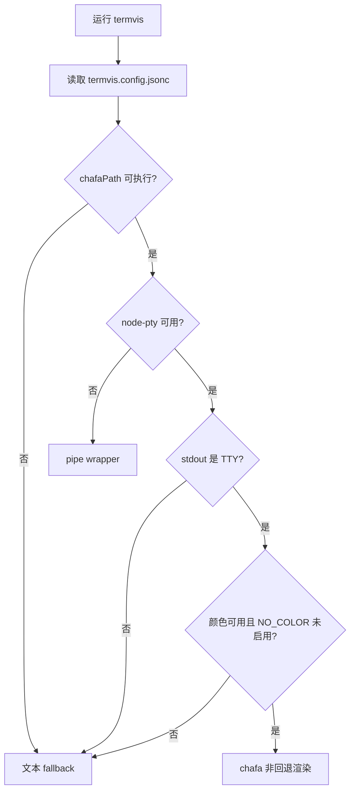
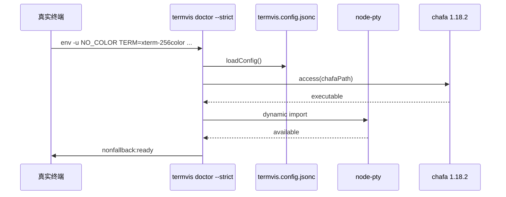

# 非回退状态安装与验证指南

本文档定义“非回退状态”的硬条件，并记录当前仓库已经完成的安装与配置。

## 非回退状态定义

`termvis` 的非回退状态不是“永远不处理 fallback 分支”，而是在真实交互终端中满足以下条件时，主链路会走真实视觉渲染，而不是文本 fallback：

| 条件 | 当前状态 | 验证方式 |
|---|---|---|
| `node-pty` 已安装 | 已安装 `node-pty@1.1.0` | `npm ls node-pty --depth=0` |
| `chafa` 可执行文件可用 | 已安装到 `.termvis/chafa-1.18.2/bin/chafa` | `.termvis/chafa-1.18.2/bin/chafa --version` |
| 项目配置固定 chafa 路径 | 已配置 `termvis.config.jsonc` | `node ./bin/termvis.js doctor --json` |
| 运行环境是真实 TTY | 需要在终端中运行 | `node ./bin/termvis.js doctor --strict` |
| 终端支持颜色 | 需要非 `TERM=dumb` 且未设置 `NO_COLOR` | `env -u NO_COLOR TERM=xterm-256color COLORTERM=truecolor ...` |
| 渲染结果不是 fallback | 已用 SVG fixture 验证 | `render` 输出中 `metrics.fallback=false` |

## 当前安装结果

chafa 通过官方源码 tag `1.18.2` 用户级构建安装，无需 root：

```text
.termvis/chafa-1.18.2/bin/chafa
```

当前构建能力：

```text
Chafa version 1.18.2
Loaders: AVIF GIF HEIF JPEG JXL PNG QOI SVG TIFF WebP XWD
Features: mmx sse4.1 popcnt avx2
```

当前项目配置：

```jsonc
{
  "render": {
    "backend": "system",
    "chafaPath": ".termvis/chafa-1.18.2/bin/chafa"
  }
}
```

## 必跑验证

在真实终端中运行：

```bash
env -u NO_COLOR TERM=xterm-256color COLORTERM=truecolor \
  node ./bin/termvis.js doctor --strict
```

期望输出包含：

```text
chafa:      .termvis/chafa-1.18.2/bin/chafa
node-pty:   available
terminal:   80x24, 24-bit color
no color:   no
nonfallback:ready
```

验证真实渲染：

```bash
env -u NO_COLOR TERM=xterm-256color COLORTERM=truecolor TERMVIS_PIXEL_PROTOCOL=none \
  node ./bin/termvis.js render test/fixtures/termvis-sample.svg --alt "termvis sample" --json
```

期望 JSON 中包含：

```json
{
  "mode": "symbols-truecolor",
  "command": "chafa",
  "metrics": {
    "fallback": false,
    "stderr": ""
  }
}
```

如果在 Kitty/iTerm2/Sixel 终端中运行，可以去掉 `TERMVIS_PIXEL_PROTOCOL=none`，让能力探测优先选择像素协议。

## 为什么普通自动化命令仍可能显示 fallback

在非交互执行环境中，`stdout` 不是 TTY，且 `TERM` 常是 `dumb`。这种情况下视觉协议没有可写入的终端表面，`termvis` 会正确报告：

```text
stdout is not a TTY
terminal color/interactive capability insufficient
```

这不是安装失败，而是运行环境不满足真实视觉渲染条件。要验证非回退状态必须使用真实 TTY，或使用本仓库当前验证方式中的 `tty` 分配。

## 故障排查

| 现象 | 原因 | 修复 |
|---|---|---|
| `chafa not found` | 配置路径缺失或文件不可执行 | 检查 `termvis.config.jsonc` 的 `render.chafaPath` |
| `node-pty unavailable` | npm 依赖未安装 | 运行 `npm install` 或 `npm ci` |
| `stdout is not a TTY` | 在 CI/管道/非交互 shell 中运行 | 改到真实终端中运行 |
| `terminal color/interactive capability insufficient` | `TERM=dumb` 或 `NO_COLOR` 生效 | 使用 `env -u NO_COLOR TERM=xterm-256color COLORTERM=truecolor` |
| `metrics.fallback=true` | chafa 不可执行、权限策略阻止或终端能力不足 | 运行 `doctor --strict` 查看原因 |

## Mermaid 链路图




