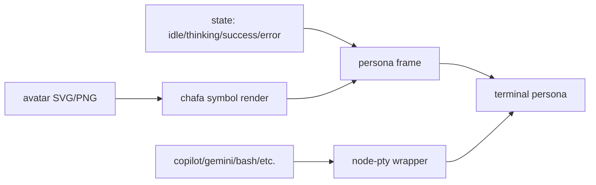
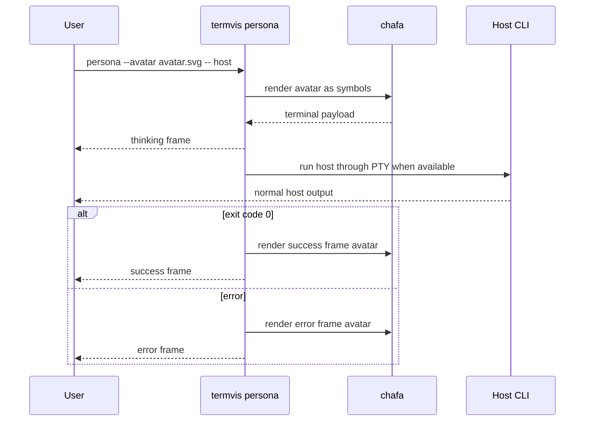

# 生命感终端 Persona

`termvis persona` 是轻量 avatar 外壳。项目主入口现在是 `termvis life`：它有 strict 非回退、生命状态机、PTY 观察、terminal title pulse 和 JSONL trace。需要完整“数字生命终端”时优先使用 [`docs/LIVING_TERMINAL_ARCHITECTURE.md`](./LIVING_TERMINAL_ARCHITECTURE.md) 中的 `life`。

Persona 默认强制使用 chafa symbols 渲染，把虚拟形象转成终端字符和彩色符号。只有显式传入 `--pixel` 时才会使用 Kitty/iTerm/Sixel 这类像素协议。

## 核心概念



这条链路的含义：

- avatar 是你的虚拟形象素材，可以是 SVG、PNG、WebP 等 chafa 支持的格式。
- chafa 把 avatar 转成终端符号和彩色字符。
- persona frame 把状态、心情文案、宿主命令和 avatar 组合起来。
- 宿主 CLI 仍然是原来的 Copilot、Gemini、bash 或其他命令，`termvis` 不侵入它们内部。

## 直接显示虚拟形象

```bash
node ./bin/termvis.js persona \
  --title "Cute CLI" \
  --message "ready to help"
```

指定状态：

```bash
node ./bin/termvis.js persona \
  --title "Cute CLI" \
  --state thinking \
  --message "composing a response"
```

可用状态：

| 状态 | 用途 |
|---|---|
| `idle` | 待命 |
| `listening` | 等待输入 |
| `thinking` | 正在处理 |
| `success` | 命令完成 |
| `error` | 命令失败 |

## 使用自己的虚拟形象

```bash
node ./bin/termvis.js persona \
  --avatar ./assets/my-avatar.svg \
  --title "My Terminal" \
  --message "online"
```

控制 avatar 在终端中的符号化尺寸：

```bash
node ./bin/termvis.js persona \
  --avatar ./assets/my-avatar.png \
  --avatar-width 36 \
  --avatar-height 16 \
  --title "My Terminal"
```

如果确实想用终端像素协议而不是符号化字符：

```bash
node ./bin/termvis.js persona \
  --avatar ./assets/my-avatar.png \
  --pixel \
  --title "My Terminal"
```

内置默认 avatar 会从包内自动解析；需要固定项目级头像时显式传入：

```text
termvis setting --avatar ./assets/my-avatar.png
```

## 包装真实 CLI

让 Copilot CLI 带上虚拟形象外壳：

```bash
node ./bin/termvis.js persona \
  --title "Copilot Persona" \
  --message "launching Copilot" \
  -- copilot
```

让 Gemini CLI 带上虚拟形象外壳：

```bash
export GEMINI_API_KEY="your-key"

node ./bin/termvis.js persona \
  --title "Gemini Persona" \
  --message "launching Gemini" \
  -- gemini
```

包装任意命令：

```bash
node ./bin/termvis.js persona \
  --title "Build Companion" \
  --message "watching tests" \
  -- npm test
```

命令执行流程：



## 非回退检查

要让 avatar 真的由 chafa 彩色符号化，而不是文本 fallback，先在真实终端运行：

```bash
env -u NO_COLOR TERM=xterm-256color COLORTERM=truecolor \
  node ./bin/termvis.js doctor --strict
```

期望看到：

```text
nonfallback:ready
```

如果输出是 fallback，说明当前环境不是交互式 TTY、颜色能力不足、`NO_COLOR` 生效，或 chafa/node-pty 配置缺失。
