# 技术栈、链路与分层设计

本文档把 `deep-research-report.md` 的调研结论落到当前代码结构中，目标是让后续开发遵守两个原则：

- 内部聚合：配置、能力探测、布局、渲染、安全、插件都收敛到 `TermvisEngine`。
- 外部低耦合：CLI、MCP、sidecar、Codex、Claude Code、GitHub Copilot CLI、Gemini CLI、OpenCode 只依赖稳定入口，不直接依赖 chafa、life 状态机或布局细节。

## 权威来源矩阵

| 领域 | 来源 | 对实现的约束 |
|---|---|---|
| chafa 渲染 | https://hpjansson.org/chafa/man/ | 使用 `--format`、`--colors`、`--view-size`、`--font-ratio`、`--symbols`、`--work`、`--threads` 形成渲染参数；像素协议不可用时退到 symbols |
| chafa 能力边界 | https://hpjansson.org/chafa/ | chafa 是 terminal graphics / Unicode mosaics / symbolic avatar renderer，不承担完整输入控件和宿主 UI 管理 |
| chafa API | https://hpjansson.org/chafa/ref/ | V2 可以引入 C API 或绑定，但 V1 先用 CLI 子进程降低 ABI 和许可证复杂度 |
| PTY | https://github.com/microsoft/node-pty | `node-pty` 用于让宿主 CLI 认为自己运行在真实终端；Windows 依赖 ConPTY；不能跨 worker 线程共享 PTY |
| Node TTY | https://nodejs.org/api/tty.html | `isTTY`、`columns`、`rows`、`getColorDepth()` 是能力探测基础，但要接受误报/漏报 |
| Node child_process | https://nodejs.org/api/child_process.html | chafa runner 使用 `spawn(command, args)`，不走 shell 拼接，降低命令注入风险 |
| Node net IPC | https://nodejs.org/api/net.html | sidecar 支持 Unix domain socket 与 Windows named pipe；socket 路径长度与生命周期要显式处理 |
| MCP | https://modelcontextprotocol.io/specification/2025-11-25/basic | MCP 基于 JSON-RPC；server 只暴露必要工具，避免工具面过宽 |
| MCP transports | https://modelcontextprotocol.io/specification/draft/basic/transports | stdio 使用 `Content-Length` framing；server 必须保持 stdin 读取，不能启动即退出 |
| Codex MCP | https://developers.openai.com/learn/docs-mcp | Codex CLI/IDE 可共享 MCP 配置；adapter 输出 `config.toml` snippet |
| Claude Code MCP/plugin | https://code.claude.com/docs/en/mcp | Claude Code 支持插件内 MCP server、`${CLAUDE_PLUGIN_ROOT}`、项目/用户 scope |
| GitHub Copilot CLI | https://docs.github.com/en/copilot/concepts/agents/copilot-cli/about-copilot-cli | Copilot CLI 可作为交互式或 programmatic host；`termvis run -- copilot` 保持宿主低耦合 |
| Copilot CLI MCP | https://docs.github.com/en/copilot/reference/copilot-cli-reference/cli-command-reference | 本地 MCP 使用 `command`、`args`、`tools`、`cwd`、`env`、`timeout`；`--additional-mcp-config` 支持单次会话 |
| `gh copilot` | https://cli.github.com/manual/gh_copilot | 通过 `gh copilot -- <args>` 转发 Copilot CLI 参数 |
| Gemini CLI MCP | https://google-gemini.github.io/gemini-cli/docs/tools/mcp-server.html | Gemini CLI 通过 `settings.json` 的 `mcpServers` 发现 stdio/http/sse MCP server |
| Gemini CLI config | https://google-gemini.github.io/gemini-cli/docs/get-started/configuration.html | `.gemini/settings.json` 支持项目级 MCP server、tool include/exclude、trust 与 timeout |
| OpenCode config/MCP | https://opencode.ai/docs/config/ 与 https://opencode.ai/docs/mcp-servers | OpenCode 使用 JSON/JSONC 配置，本地 MCP server 通过 `mcp` 字段接入 |
| JSON-RPC | https://json-rpc.org/specification | sidecar 使用 request/response/error 的 2.0 结构，错误码保持标准区间 |
| Unicode 宽度 | https://www.unicode.org/reports/tr11/ | CJK、emoji、组合字符不能用字符串长度处理；line-grid 必须按 cell width 计算 |
| NO_COLOR | https://no-color.org/ | `NO_COLOR` 存在且非空时跳过 ANSI 颜色，优先可读纯文本 |
| Ink | https://github.com/vadimdemedes/ink | 借鉴 Flexbox/Yoga 思想，但不把 React runtime 作为核心依赖 |
| Rich Layout | https://rich.readthedocs.io/en/latest/layout.html | 借鉴 row/column split、ratio、fixed size、minimum size 的终端布局经验 |
| xterm.js/headless | https://github.com/xtermjs/xterm.js | 当前用内置 `HostViewport` 覆盖 AI CLI 常见 VT 序列并保护左右布局；后续完整回放/Web 观测可接入成熟 terminal buffer |
| Node test runner | https://nodejs.org/api/test.html | 当前测试使用 `node --test`，避免未安装依赖时无法验证核心逻辑 |

## 分层结构

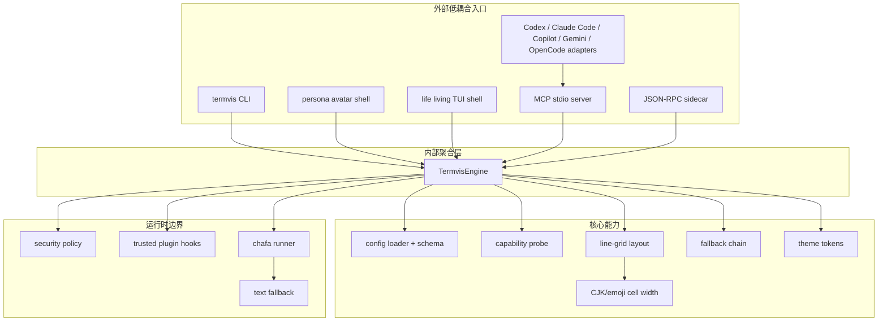

## Report-3 视觉与兼容落地清单

`deep-research-report-3.md` 的关键要求已经映射为可测试实现，而不是停留在概念层：

| Report-3 要求 | 当前实现 |
|---|---|
| chafa 是表现/回退层，不是人格系统 | chafa 只渲染 avatar/image；persona、mood、presence、reply、BPM 在 `src/life/soul.js` |
| 常驻左右布局，不做上下分屏 | `termvis life` 固定为左侧 ambient soul rail + 右侧 host viewport |
| 宿主 CLI 不能遮挡生命层 | `HostViewport` 解析宿主 VT 流并只 diff 到右侧 viewport |
| 低噪现代感，不做热闹 CLI | rail 去掉重边框，使用细生命线、固定 footer、低频 `maxFps`、克制 token |
| 中文/emoji/组合字符不崩 | `src/core/width.js` 统一 ANSI 清理、grapheme 和 East Asian width 处理 |
| truecolor -> 256 -> mono | `src/core/theme.js` 按能力输出 truecolor、ANSI 256 或纯文本 |
| NO_COLOR / reader mode | `NO_COLOR` 禁颜色；`termvis life --reader/--plain` 输出线性 alt-text |
| LLM 生成 soul 文本但不控制宿主 | `termvis_soul_event` 写 `.termvis/soul-events`，TUI 轮询后只更新 rail |

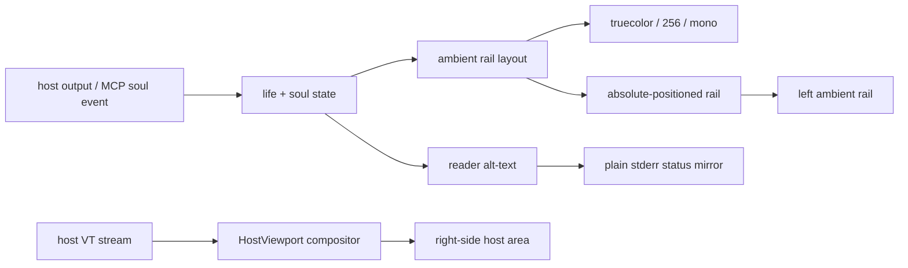

代码入口：

- 聚合层：`src/application/termvis-engine.js`
- CLI：`src/cli/main.js`
- living terminal runtime：`src/cli/life.js`、`src/life`，其中 `src/life/tui.js` 负责左侧 soul rail，`src/life/viewport.js` 负责右侧 host VT compositor 和 diff painter
- digital soul event runtime：`src/life/soul.js` 负责 persona、LLM 自定义 mood/presence/reply、稳定 BPM、`.termvis/soul-events` 与 visual-only 事件
- persona 轻量外壳：`src/cli/persona.js`、`src/persona/persona-shell.js`
- MCP：`src/mcp/server.js`
- sidecar：`src/sidecar/server.js`
- adapters：`src/adapters/registry.js`
- schema：`src/core/schema.js`

## 包内依赖方向

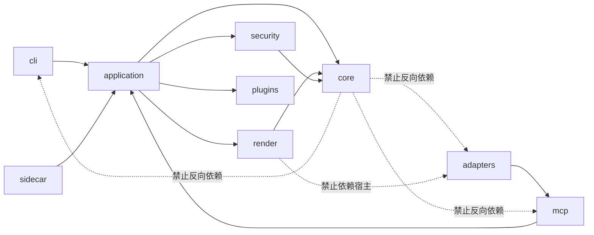

约束：

- `core` 不知道 Codex、Claude Code、OpenCode。
- `render` 不知道 MCP、sidecar、CLI。
- `adapters` 只生成宿主配置，不直接调用渲染器。
- `TermvisEngine` 是外部入口唯一需要依赖的运行聚合面。

## 渲染链路

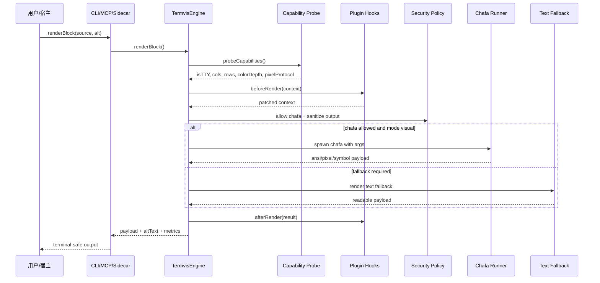

## 回退状态机

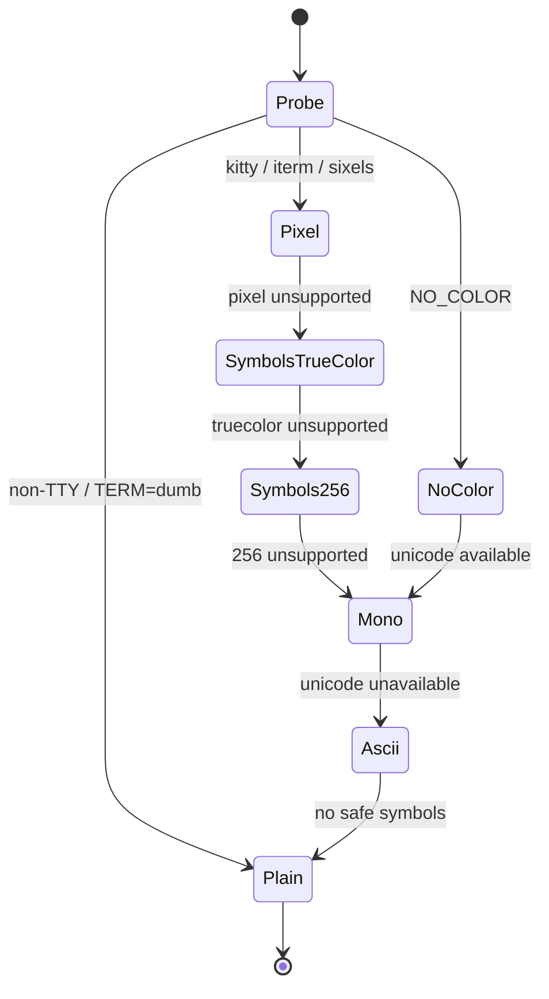

当前实现的回退链由 `src/core/fallback.js` 固化：

```text
kitty -> iterm -> sixels -> symbols-truecolor -> symbols-256 -> mono -> ascii -> plain
```

## Sidecar 控制面

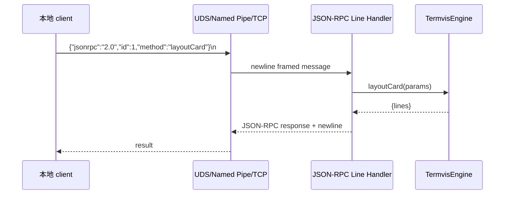

Sidecar methods:

| Method | 用途 |
|---|---|
| `ping` | 存活检查 |
| `probeCaps` | 能力探测 |
| `layoutCard` | 生成 line-grid 卡片 |
| `renderBlock` | 经由聚合层渲染视觉块 |
| `soul.init` | 创建本地 visual-only soul session |
| `soul.getState` | 读取并应用 soul event 后返回当前状态 |
| `soul.renderTick` | 返回 soul rail 文本 diff 与 alt-text |
| `soul.setTheme` | 控制面主题切换确认 |
| `soul.consent` | 记录 memory/主动台词/TTS 等同意门结果 |
| `cwd` | 返回工作目录 |

## MCP 工具面

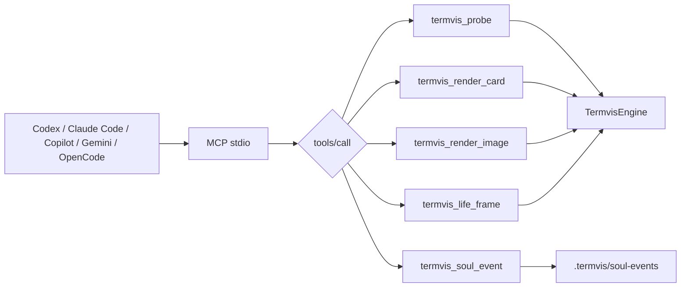

MCP 工具保持窄接口：

- `termvis_probe`：只读能力探测。
- `termvis_render_card`：纯文本布局工具。
- `termvis_render_image`：图像路径渲染，失败则返回文本 fallback。
- `termvis_life_frame`：按宿主、状态和消息渲染 living terminal 帧。
- `termvis_soul_event`：写入 LLM 生成的 visual-only mood/presence/BPM/reply/narration 事件；不会写入宿主 CLI。

## Living Terminal 链路

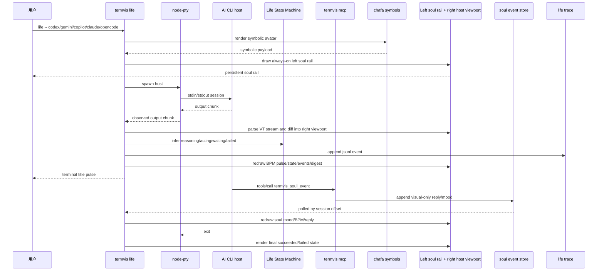

`termvis life` 默认 strict：没有 TTY、颜色能力、chafa 或 `node-pty` 时直接失败；只有显式 `--allow-fallback` 才允许降级，这个开关主要用于 CI 和文档演示。

宿主输出推断的 mood 变化不会增加 LLM soul event 计数。LLM 可以写入自定义 mood/presence/reply；内置 mood 使用预设 BPM，custom mood 使用 adaptive BPM 或显式 `heartBpm`。这样高频 stdout 不会被误读成心跳增长，`heart BPM` 始终是由 mood/state 决定的稳定脉搏。

## Host Adapter 边界

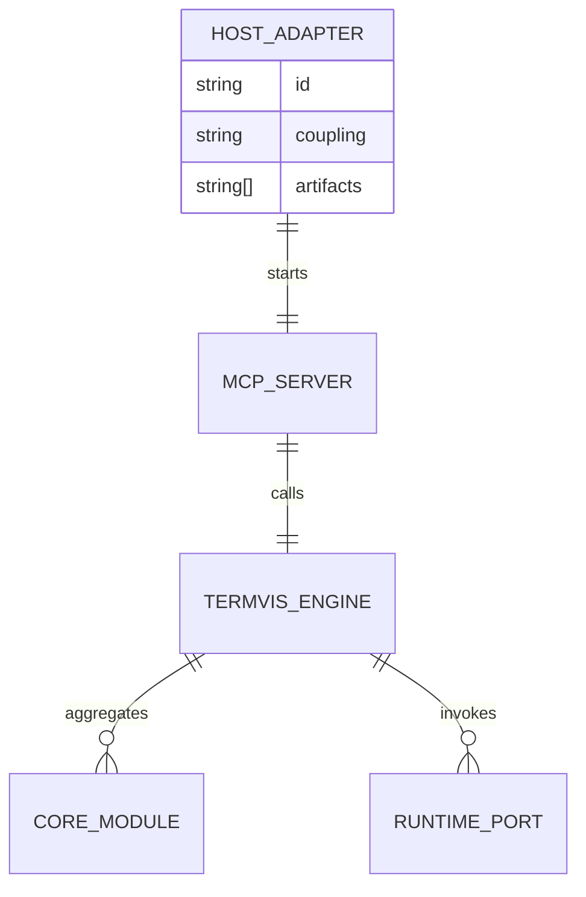

| Host | 接入方式 | 产物 | 低耦合原因 |
|---|---|---|---|
| Codex | MCP stdio in `config.toml` | `[mcp_servers.termvis]` snippet | Codex 只启动 `termvis mcp`，不绑定内部模块 |
| Claude Code | plugin-bundled MCP | `plugin.json`、`.mcp.json`、skill | 插件只包装 MCP server，内部能力仍在 termvis |
| GitHub Copilot CLI | workspace/session MCP config + living wrapper | `.mcp.json`、`.copilot/termvis-mcp-config.json`、`termvis life -- copilot` | Copilot 只发现/启动 `termvis mcp` 或被 life PTY 包装，不依赖内部模块 |
| Gemini CLI | project settings MCP + extension + living wrapper | `.gemini/settings.json`、`.gemini/extensions/termvis`、`termvis life -- gemini` | Gemini 只通过项目配置发现 MCP server；extension 也只声明 stable command |
| OpenCode | JSONC local MCP config | `opencode.jsonc` snippet | OpenCode 只读取本地 MCP command |

CLI：

```bash
node ./bin/termvis.js adapter list
node ./bin/termvis.js adapter all
node ./bin/termvis.js adapter codex
node ./bin/termvis.js adapter claude
node ./bin/termvis.js adapter copilot
node ./bin/termvis.js adapter gemini
node ./bin/termvis.js adapter opencode
```

Copilot/Gemini 的实际启动与验证命令集中记录在
[`docs/COPILOT_GEMINI_USAGE.md`](./COPILOT_GEMINI_USAGE.md)。

## 配置 Schema 链路

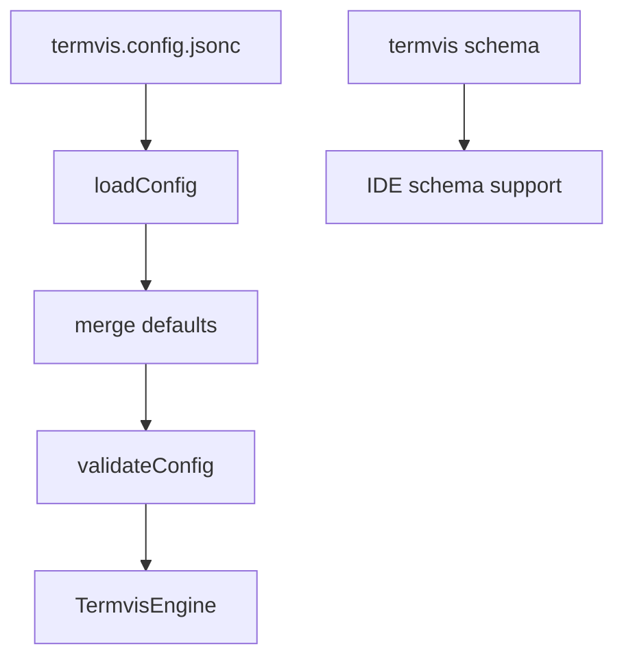

当前命令：

```bash
node ./bin/termvis.js schema
node ./bin/termvis.js schema --compact
```

## 安全策略

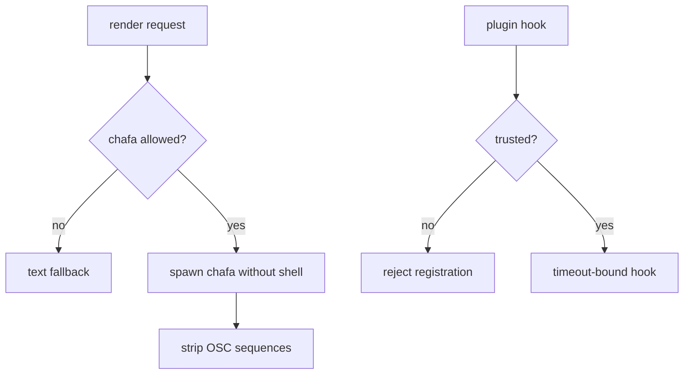

默认策略：

- `security.execAllowlist = ["chafa"]`
- `security.network = false`
- 未信任插件拒绝注册
- 输出经过 OSC 序列清理，避免剪贴板/标题等隐式控制序列
- `child_process.spawn(command, args)` 不经过 shell 字符串拼接

## 测试闭环

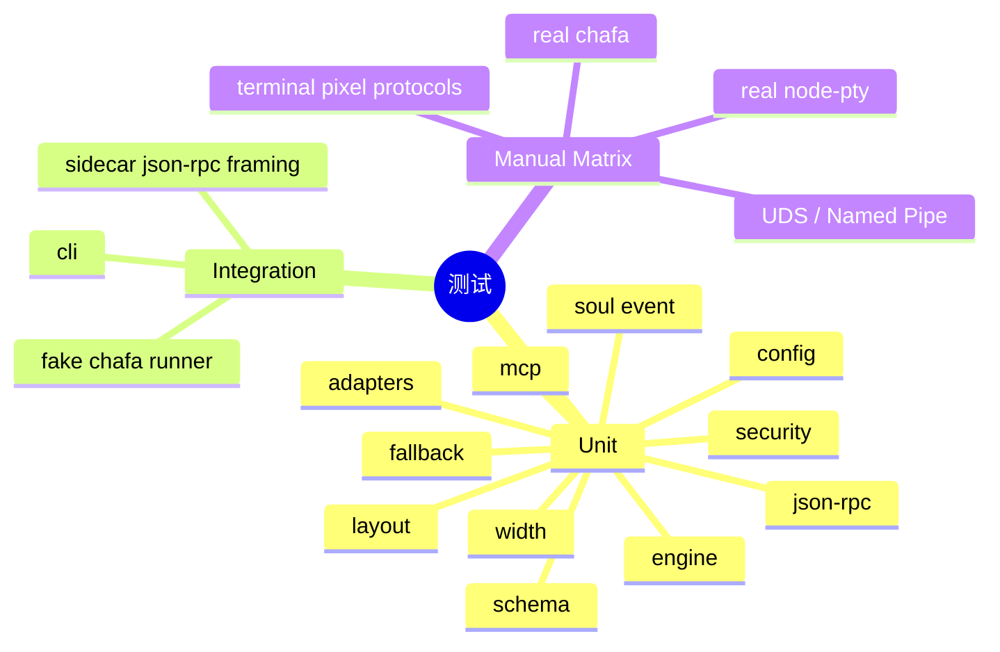

当前自动测试：

```bash
npm test
npm run check
```

## 后续扩展点

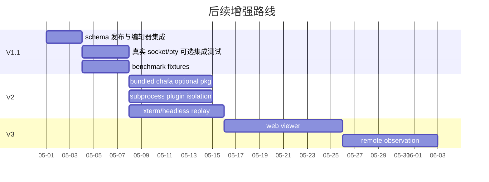
